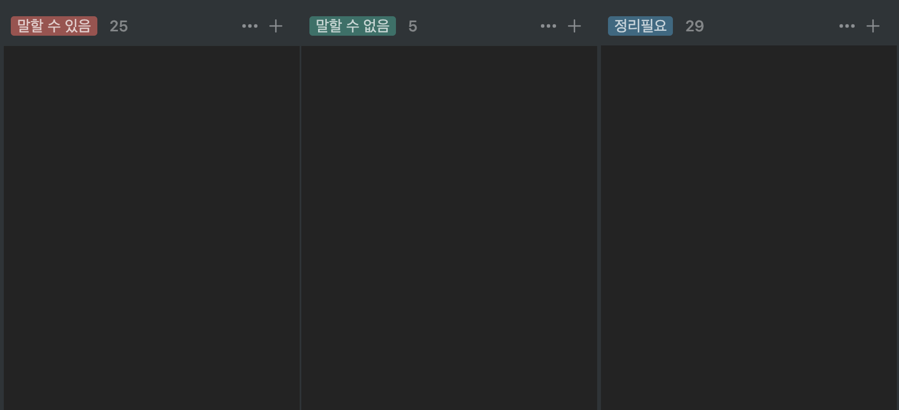

2020년은 저에게 소중한 경험들이 많았습니다. 코로나로 인해 생활이 변화해 새로운 취미도 생겼고 이직을 해서 새로운 시작이 되었습니다. 2020년을 마무리하며 회고를 해보려 합니다.

## 이직

개인적으로 올해의 가장 큰 변화 중 하나입니다. 이직의 사유와 면접을 보며 느꼈던 부분을 작성했습니다.

### 새로운 도전

올해의 새로운 도전 중 하나는 이직이었습니다. 기존에 개발하고 있던 서비스도 매력적이었지만 어느 순간 저 자신에게 의문이 생기기 시작했습니다. _"나는 어떤 서비스를 개발하고 싶은 개발자일까?"_ 에 대한 물음표가 생겼고 꽤 오랫동안 고민을 했습니다.

학부 시절 개발자가 되고 싶다고 컴퓨터 공학과로 전공을 바꾸기로 했을 때 _"사람들이 생활 속에서 유용하게 사용할 수 있는 것"_ 을 만들고 싶은 것이 떠올랐습니다. 이 생각의 연장선이 _"사람들의 일상생활에 자연스럽게 녹아드는 서비스 만들기"_ 로 다듬어졌습니다. 일상생활에 자연스럽게 녹아든다는 것은 그만큼 사람들이 자주 사용할 만큼 유용한 서비스라는 것을 내포하고 있다는 생각이 들었고, 무조건 고객 관점에서 생각하기라는 가치관도 생겼습니다.

고객 중심의 가치관을 중요시하고 남녀노소 누구나 일상생활에 스며들 수 있는 서비스를 찾게 되었습니다. 여러 회사가 있었는데 그 중 우아한 형제들의 '배달의 민족'과 비바리퍼블리카의 '토스'가 눈에 들어왔습니다.

**배달의 민족**  
배달의 민족은 항상 사용할 때마다 굉장히 재밌는 요소들이 많았습니다. 키치한 UI 중 인상 깊었던 부분이 있는데 모바일에서 리스트를 새로 고치기 위해서 아래로 당기는 액션을 취하게 됩니다. 여기서 '땡겨요' 라는 문구와 함께 음식들이 랜덤하게 선택됩니다. 이 부분도 신선하게 다가왔고, 하루는 뭐 먹을지 생각하며 아무 생각 없이 리스트를 계속 당겼더니 '이제 그만 놔줘요….' 라는 문구가 있는 것을 발견했습니다. 이러한 배달의민족의 디테일들을 보고 사용자들이 평범하게 느낄 수 있는 부분을 배민스럽게 잘 녹여냈다는 생각이 들었습니다.

**토스**  
토스는 앱을 설치하고 들어갔을 때 정보를 입력하는 부분부터 간단한 계좌 및 카드등록까지 스무스하게 흘러갔고 네이티브 앱과 웹 뷰의 차이를 못 느낄 정도로 자연스러웠습니다. 그리고 토스의 핵심 가치관 중 하나인 고객 중심으로 생각하여 고객에게 전달해줄 수 있는 가치를 최우선으로 여긴다는 부분이 와닿았고, 채용공고들과 토스의 블로그들을 보았는데 전통적인 기업문화와는 다른 문화를 가지고 있었습니다. 토스의 문화를 가진 동료들과 함께라면 시너지를 내어 지금보다 더 훌륭한 서비스를 만들 수 있겠다는 생각이 들었습니다.

### 면접을 보며

개발 직군의 경우 기술면접이 거의 들어가 있고 코딩테스트나 과제 같은 경우에는 기업마다 다를 수 있기에 기술면접에 대한 예상 질문 답변 리스트를 노션에 정리했었습니다. 머릿속에서 맴도는 사소한 질문들까지 작성하다 보니 목록이 많아졌는데, 이를 정리하면서 제가 알고있는 지식과 알지 못하는 지식이 어느 정도 분리가 되었습니다. 하지만 정리하면서 개인적으로 위험하다고 생각할 수 있는 분류가 **'알고 있다고 착각하는 것'**이었습니다.

사실 '알고 있다'라는 말을 할 수 있다는 것은 개인마다 정도가 조금 다를 수 있는데 이번 면접 경험을 통해 저만의 기준을 세우게 되었습니다. 지금까지 제가 봐왔던 기술면접에서는 면접관이 면접자에게 _"해당 기술에 관해 설명해주세요."_ 라는 형식의 질문을 받았었습니다. 면접자는 면접관이 이미 해당 기술에 대한 지식을 알고 있다는 전제하에 기술용어들을 설명에 섞어서 이야기하게 됩니다.

여기서 전제를 조금 바꿔서 질문자가 개발을 시작한 지 얼마 안 되었거나 해당 기술에 모르는 사람이라고 가정해본다면 답변이 조금 달라집니다. (물론, 개발을 처음부터 잘하시는 분들도 계시지만 저의 경우에 그렇지 않았기 때문에 제 나름대로 기준을 잡았습니다) 설명을 위한 기술적인 용어가 들어간다 해도 쉽게 풀어서 설명해야 하며 꼭 기술용어가 들어가야 하는 상황이라면 이에 대한 추가설명도 쉽게 풀어서 설명해야 합니다. 이렇게 전제를 바꿔서 답변 준비를 하다 보면 더 나아가서 비 개발 직군과 의사소통할 때에도 조금 수월해지지 않을까 하는 생각이 들었습니다.

그래서 저의 기준은 **_"해당 기술을 모르는 사람이라고 생각하고 설명해주세요."_** 로 변경되었습니다. 앞으로 이 기준을 통해 답변을 준비하고 공부를 하게 된다면 더 좋지 않을까 하는 생각이 들었습니다.

> 면접을 준비할 때 나열했던 리스트들입니다. 당시에 정리필요 항목이 너무 많아서 반성을 하게됩니다...

## 코로나19

### 재택근무

코로나 19로 인해 재택근무를 자주 하게 되었는데 그전에는 집에서 개발환경이 물리적으로 제대로 갖춰지지 않아서 이참에 모니터도 구입하고 세팅을 했습니다. 재택근무를 장단점이 있는데 장점은 외부의 간섭 없이 몰두해야 하는 업무가 상대적으로 잘 된다는 것이고 단점은 팀원들과의 커뮤니케이션입니다. 오피스에서 업무를 볼 때 간단한 내용은 자리에서 이야기하고 처리하는 부분들이 있는데 이런 것들 모두 텍스트 혹은 회의를 통해야 합니다. 단점이라고 말했지만 사실 장점이 될 수도 있는 부분입니다. 구두로 이야기했던 부분들을 기록으로 남긴다는 점과 효율적인 화상회의를 위해 평소보다 신경을 더 많이 썼던 것 같습니다.

그래도 저는 사무실에서 일하는 게 더 좋았습니다. 오피스에서 업무를 마무리 짓고 집에서는 편안한 휴식을 취하려 해서 물리적으로 분리하는 것이 좋았습니다. 다른 한 가지는 아무래도 사람들을 만나는 것이 좋고 무엇보다 업무 외에도 재밌는 일들이 생기기 때문에 재택보다 행복한 날들이 많았던 것 같습니다.

### 아쉬운 여행과 새로운 취미

코로나 19로 인해 회사, 생활, 취미 등 모든 것이 바뀌었습니다. 그중 가장 아쉬웠던 것이 있는데 작년부터 제 인생의 첫 해외여행을 다녀오고 싶어 짜놓은 계획이 무산되었다는 것입니다. 게다가 평소 밖에 나가서 돌아다니고 놀기를 좋아했지만, 실내에서 보내야 하는 것들을 찾아야 했습니다. 넷플릭스, 닌텐도, 다큐멘터리를 보며 나름대로 힐링을 했습니다.

특히 기억에 남는 닌텐도 게임들이 있는데 '슈퍼마리오 메이커2'와 '오버쿡2' 입니다. '슈퍼마리오 메이커2'는 맵을 유저들이 만들고 플레이할 수 있게 맵 메이킹을 할 수 있습니다. 그리고 4명이 서로서로 도와서 맵을 깨는 모드가 있고 깃발을 차지하기 위해 서로서로 ~~담가서~~ 깨는 모드가 있습니다. 그중 제일은 상대들을 무찌르는 '서로서로 담가요'가 재밌더라고요.

> 이미지출처: 한국닌텐도 온라인 스토어

다른 게임은 여러 명이 같이 플레이할 수 있는 '오버쿡2'인데요. 여러 명이 각종 재료를 다듬어서 요리를 만드는 협업 게임입니다. 계속 플레이를 하고 있는데 주의할 점은 일에서 벗어나고 싶어 게임을 하지만 오히려 더 바쁜 모습을 깨닫게 됩니다. 그리고 뇌 정지가 오는 자신의 모습을 볼 수 있습니다. 그래도 여러 명이 단순하고 재밌게 할 수 있는 게임 중 하나입니다..

> 이미지출처: 닌텐도

---

## 새로운 시작

2020년에 비바리퍼블리카의 토스팀에 합류했습니다. 제 인생에 있어서 토스팀이 인생의 터닝포인트로 작용했으면 좋겠습니다. 그래서 2021년의 목표와 계획을 세우고 싶습니다.

- **고객 입장에서 생각하며 개발하기**: 서비스를 이용하는 사람은 고객이기 때문에 개발자는 개발의 가치를 고객에게 두어야 한다고 생각합니다.
- **React로의 전환**: 토스팀은 React를 사용하고 있지만, 기존에 사용하던 기술은 Angular였습니다. 토스팀의 기술 스택을 빠르게 맞춰야 협업하는 데 무리가 없을 것 같다는 생각입니다.
- **꾸준한 기술 블로그 글 작성**: 면접 경험을 통해 세운 저만의 기준을 통해 학습하여 글을 작성해보려 합니다. 2020년에는 꾸준한 글 작성과 기준이 모호했던 것 같습니다. (반성)
- **매일 기록하기**: 그날 무얼 했고, 팔로우업 해야 하는 일들은 무엇인지 등등 디테일하게 챙기고 싶어 실천하고 싶습니다.
- **오전 7시 기상**: 아침잠을 줄이고 개인 시간을 사용하고 싶습니다. 저녁에는 약속 또는 다른 일들이 생길 수 있어 아침이 더 자유롭게 쓸 수 있는 시간이라고 생각되었기 때문입니다.
