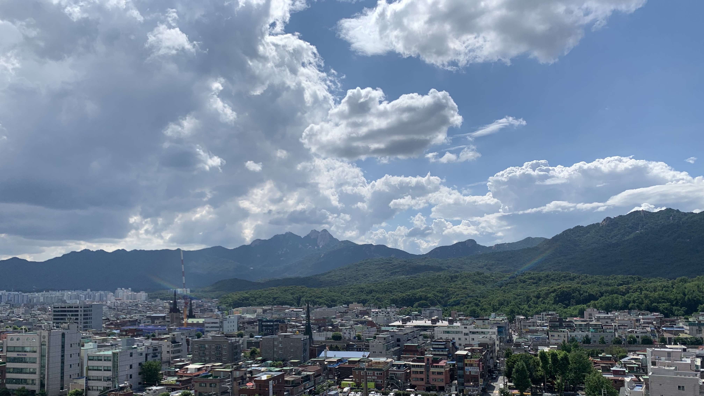
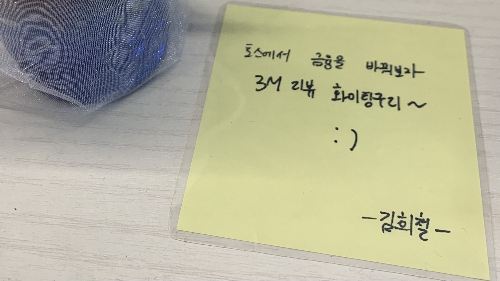
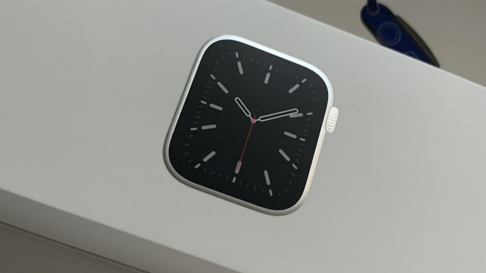
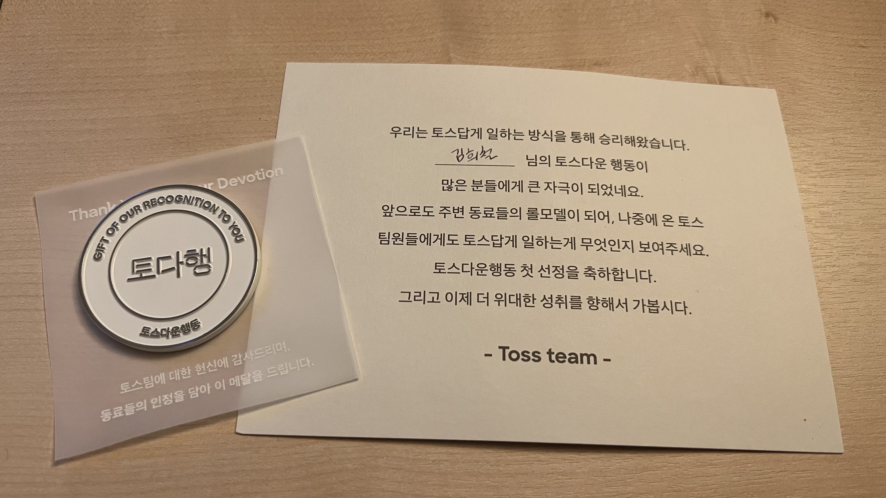

## 들어서며

어느덧 2021년이 마무리되어가며 지금까지 어떻게 살아왔는지 살펴보려 합니다. 문득 12월은 아날로그 시계 속 숫자 12처럼 끝임과 동시에 다시 시작을 준비하는 차분하면서도 바쁜 달인 거 같습니다.

12월은 그간 못 만났던 친구들 가족들 지인들을 만나 서로 어떻게 지냈냐며 인사를 합니다. "좋은 연말연시 보내세요", "메리 크리스마스 and 해피 뉴 이어" 와 같은 말을 주고받으며 드는 바쁜 생각이 있습니다.

1. 연말정산 후 내년 금융계획 세우기
2. 회고하며 내가 내년엔 어떻게 살지 계획 세우기

1번은 개인마다 다르니 차치하고 2번의 기본 계획은 세우고 살아야 어느 정도 큰 틀이 잡히지 않을까 싶었습니다. 그렇다면 과연 2020년에 세웠던 2021년 새해 다짐들은 얼마나 지켜졌는지, 혹은 못 지켰다면 왜 못 지켰는지 살펴보겠습니다.

### 2021년 새해 다짐 되짚어보기

**1번: 고객 입장에서 생각하며 개발하기 (성공)**

같은 제품을 만드는 팀에서 무조건 기획자가 기능을 정의하고 디자이너가 화면을 구성하고 엔지니어들이 그에 따라 개발하는 것은 아니라고 생각합니다. 직군별로 갖는 강점이 다른 것이지 '이 기능이 필요한가?', '이 문구가 이 상황에서 적절한가?', '화면의 디자인이 제품의 방향과 일치하는가?'와 같은 고민은 누구라도 할 수 있어야 한다고 생각합니다.

사람마다 고객 입장에서 생각하며 개발한다는 것이 다를 수 있지만 저는 이상하다고 생각하는 지점이 있다면 더 나은 방법을 제시하고 AB 테스트를 진행해보는 등 실행에 빨리 옮겼던 것 같습니다. '성공'이라는 단어보다는 이런 생각을 지속해서 가져가고 싶습니다.

**2번: React로의 전환 (성공)**

2021년에 React 로의 전환이 있었는데, 이는 현재 직장(토스)에서 사용하는 기술스택이기 때문에 당연하게 전환해야 했습니다. 이전에는 Angular 를 사용했기 때문에 React 를 사용하는것이 굉장히 낯설었고 퍼포먼스도 잘 나지 않았습니다. 'Angular 로 하면 이렇게 했을텐데 React 는 어떻게 구현할까?' 라는 생각이 항상 맴돌았었습니다. 그런데 이제는 오히려 Angular 가 어색하고 문법도 까먹었습니다. 사내 프론트엔드 라이브러리에도 기여하며 나름 적응했다고 생각합니다.

이렇게 적응하기까지는 주변 동료들이 온보딩을 잘 도와준 덕인 것 같습니다. 도움받으면서 "일단 PR(Pull Request)을 많이 해보면 어때요?" 라는 조언을 들었는데 굉장히 도움이 많이 되었습니다. PR을 올리면 많은 분들이 더 좋은 코드와 더 좋은 네이밍 컨벤션, 사내에 구현되어있는 라이브러리를 알려주시며 리팩토링해보면 어떻겠냐, '이런 기능이 공통으로 있으면 좋을 거 같은데 라이브러리로 만들어보실 생각없냐' 와 같은 댓글들을 남겨주셨고 이는 React 에 적응하는데에 좋은 거름이 되었던 것 같습니다.

**3번: 꾸준한 기술 블로그 글 작성 (실패)**

초기에 작성했던 [가볍게 배우는 암호학](https://www.heecheolman.dev/post/%EC%95%94%ED%98%B8%ED%95%99/), [웹 브라우저의 역사](https://www.heecheolman.dev/post/%EC%9B%B9-%EB%B8%8C%EB%9D%BC%EC%9A%B0%EC%A0%80%EC%9D%98-%EC%97%AD%EC%82%AC/) 외에는 별다른 글을 발행하지 못했습니다. 이번에 글쓰기 모임을 통해 2주에 하나씩 글을 발행하기로 했는데요. 비단 개발관련 글 뿐 아니라 생활, 생각 등 다양한 주제의 글을 작성해보려 합니다.

**4번: 매일 기록하기 (실패)**

노션을 이용해 매일 기록을 하다가 어느순간 기록을 하지 않게되었습니다. 불규칙적인 생활습관에 나름의 규칙을 채우려했지만 잘 실행되지 못한것 같습니다. 기록할 때 노션외에 다른 제품을 써볼까 했는데 역시나 종이로 기록하는것이 더 좋은가? 라는 생각이 들며 아날로그로 적어보려고 합니다.

**5번: 오전 7시 기상 (실패)**

불규칙적인 생활습관 탓에 오전 7시 기상은 1년에 2번정도 했던것 같습니다. 그런데 굳이 7시 기상이 아니더라도 일정한 시간에 일어나는 습관을 들여야하는것 같네요.

1번과 2번빼고는 모두 실패로 돌아갔습니다. 40% 성공인데 나름 높다고 생각하는데 이유는 열심히 노력했다는 제 마음입니다. 내년에는 꼭 50% 이상을 달성하도록 해야겠습니다.

---

## 2021년 주요 이벤트

2021년에 일어났던 주요 이벤트들이 많습니다. 토스팀의 3개월 리뷰를 통과한 일부터, 여러 서비스를 런칭하고 다양한 관심사를 가지며 얻었던 생각들을 작성해보려 합니다.

### 토스팀 3개월 리뷰 통과

> 토스 입사 후 온보딩 때 내가 3개월의 내 미래에게 쓰는 편지

토스팀에 2020년 11월에 합류했습니다. 다른 회사와 마찬가지로 3개월 수습기간이 있었는데요. 여기서는 3개월리뷰(3MR = 3 Month Review) 라고 불렀습니다.

저는 회사에 입사하고 나면 종종 이런 생각을 가졌던 것 같습니다. '내가 잘하고 있는게 맞는걸까?', '어떻게 더 잘할 수 있을까?' 와 같은 생각들이 머리에 맴돌았고 토스에서는 3개월리뷰가 있기에 이전 회사보다도 더 부담이 있었던것은 사실이었습니다. 그런데 온보딩일정을 소화하며 지내다보니 위와같은 걱정들이 서서히 사라지게 되었습니다. 3개월 리뷰가 있다고 해서 3개월이 지났을 때 Pass / Fail 을 딱 주는것이 아니라 '중간리뷰'를 통해 내가 어떤점을 잘하고있고 어떤점을 강화했으면 좋겠다와 같은 건강한 피드백을 들을 수 있었습니다.

처음에 느꼈던 부담감이 시간이 지날수록 점차 사라져가며 점점 자신감도 생겨 생산성이 좋아졌습니다. 마침내 3개월리뷰의 결과로 Pass 를 받게되었고 지금까지 재밌게 일을 하고 있습니다.

회사가 마냥 편한것만은 아닙니다. 회사에 느끼는 편안함이 너무 많으면 안주하고 성장을 못할 수 있고 긴장감이 너무 많으면 오히려 생산성이 떨어진다고 생각을 했습니다. 그래서 적당한 편안함과 적당한 긴장감이 비로소 신뢰받는 동료가 되는 길이 아닐까 라는 생각을 했습니다.

토스에는 신규입사자분이 들어오면 '메이트' 라는 제도가 있습니다. '메이트'는 신규입사자가 가지고 있는 긴장감과 '이런것까지 물어봐도 되나?' 싶은 궁금증 등을 지원해주는데요. 저도 좋은 메이트를 만나 도움을 받았던것처럼 새로 들어오시는 다른분들도 소프트 랜딩이 될 수 있도록 선순환이 되게끔 노력하고 있습니다.

어쨌든 3개월리뷰를 무사히 Pass 로 마치며 현재 토스의 다양한 서비스를 만들며 행복을 느끼고 있습니다. 그리고 항상 적당한 긴장감과 적당한 편안함을 지키며 성장해나가려 합니다.

> 3개월 리뷰를 무사히 통과한 기념으로다가 애플워치를 제 자신에게 선물했습니다.

### React 컴포넌트를 VanillaJS 로 포팅하기

토스에 입사하고 난 뒤 알림서비스를 제공하는 Inform 팀 에 합류했습니다. 그 중 계좌알림을 서비스를 위해 제휴은행사 웹페이지에서 동의를 받아야하는데요. 이때 유저가 A은행을 계좌알림 연동을 하고 싶다면 다음과 같은 플로우를 거쳐야합니다.

1. 계좌알림 서비스 선택 (토스앱)
2. A은행 계좌알림 연동 클릭 (토스앱)
3. A은행 웹페이지에서 플로우 진행 (은행웹페이지)
4. 계좌알림 연동완료 (토스앱)

여기서 문제는 3번입니다. 유저는 같은 토스앱을 사용하지만 은행웹페이지가 그대로 적용될 경우 전혀 다른 UI/UX 를 마주하게되어 계좌알림 서비스 퍼널 이탈율이 높을거라 생각했습니다. 그래서 외부 은행웹페이지가 마치 토스 웹뷰를 보는것처럼 수정을 해야했습니다. 하지만 TDS는 React 로 되어있었고 제휴은행사는 React 를 다루기 어려워 HTML, CSS, JS 파일로 제공해줘야했습니다.

> TDS란?
>
> Toss Design System 으로 화면 개발 시 지켜야 하는 디자인시스템 가이드라인입니다. 복잡한 화면을 이미 구현된 디자인시스템으로 레고블럭 쌓듯이 쉽게 개발할 수 있어 개발시간을 단축시켜줍니다.
>
> [관련 문서](https://blog.toss.im/tag/tds)

즉 니즈는 다음과 같았습니다.

1. _제휴은행사가 유지보수 할 수 있는 코드여야할 것_
2. _TDS 가이드라인을 지켜야할 것_

위의 두가지로 정리하고 나니 드는 생각은 현재 React 구현되어있는 TDS 컴포넌트를 HTML, CSS, JS 로 포팅해야겠다는 생각이었습니다.
먼저 React로 구현된 TDS 컴포넌트 코드와 작동방식을 살펴보고 토스 웹뷰가 토스앱의 다크모드 지원은 어떻게 하는지 파악하며 VanillaJS 로 포팅을 시작했습니다.

컴포넌트 기반이 되는 Class 를 만들고 모든 컴포넌트는 이를 상속받아 Lifecycle 을 지키도록 코드를 작성해나갔습니다. contructor 에서는 컴포넌트로 만들 대상이되는 HTMLElement 를 받아 각각 라이프사이클을 실행하도록 했습니다.

그리고 이를 라이브러리화 시켜 [Storybook](https://storybook.js.org/) 으로 가이드를 작성했습니다.

이렇게 라이브러리화를 시킨 이유는 협업해야 하는 은행사가 한군데가 아니었고 매번 HTML, CSS, JS 코드를 복사 붙여넣기로 제공하는 것이 상당히 소모적이라 생각했습니다. 또 외부 제휴사와 협업 시 예상치 못하게 다른 기술 스택을 마주하면 생산성이 배로 떨어지는 것을 느꼈고 이는 제가 아닌 다른 동료분도 똑같이 느낄 거라 생각되어 최소한의 공수로 작업할 수 있게 만들기 위함이었습니다.

결과적으로 2020년에 빠른 속도로 제휴 은행사와 협업하여 모든 계약을 성공적으로 마무리했습니다. 나름대로 의미가 있었던 프로젝트였습니다. TDS 컴포넌트의 내부 동작 원리, 토스 앱에서 웹뷰 다크모드가 적용되는 과정 등 다양한 것을 알게되었고 이는 이후 React TDS 로 작업 시 마주하는 트러블슈팅에도 도움이 되었습니다. 만약 이를 하지 않았다면 지금의 생산성이 나오지 않았을 것 같다고 생각하고 세상에 의미 없는 일은 없다는 것을 느꼈습니다.

### 그리고, 토스다운행동

토스의 문화강화 제도인 '토스다운행동'에 선정되었습니다. [토스가 중요하게 생각하는 핵심 가치](https://blog.toss.im/article/toss-core-values)를 보여줬다고 생각하면 주변 동료가 감명받은 동료에 대한 추천사를 쓰고, 모든 토스팀원들에게 투표를받아 일정 비율 이상 공감받으면 선정이됩니다. 위의 VanillaJS로 포팅하기가 첫 토스다운행동 선정사례였고, 이후에 두 번 더 선정되었습니다. 추천해주시는 동료분들께서 좋은 시선으로 봐주셨고 또 다른 주변 팀원들의 도움이 있어 선정되었다고 생각합니다.

처음에 입사했을 때 했던 걱정이 '잘 하고 있는 걸까?', '더 잘하려면 어떻게 해야할까?' 와 같은 생각이었는데요. 나름 열심히 고민하고 빠르게 실행한 탓에 좋게 봐주셨던 것 같습니다.

### 비로소 내 공간을 갖다

토스에 들어온 시점에 살고있던 집이 전세계약이 만료되는 시점이었습니다. 더 좋은 집을 가고 싶기도 해서 아파트를 알아보다가 당시 전세와 매매를 비교하니 전세자금대출과 주택담보대출에 내는 돈이 많이 차이가 없다는것을 알았습니다. 이왕이면 다홍치마라고 초초초영끌을 하여 아파트를 매매했습니다. 오래된 아파트라 가격이 그리 높지 않았던게 신의 한수였습니다. 처음에는 대출에 두려움이 있었지만 기회는 있을때 잡는것 같아 바로 실행에 옮겼습니다.

생각보다 순조롭게 계약이 진행이 되었고 비로소 등기가 찍히는것을 보고 뿌듯했습니다. 그런데 막상 그냥 들어가려고 보니 세월의 흔적이 있던만큼 화장실, 창호, 주방 등 여러 문제가 있어 인테리어를 통해 수리를 해야할 것 같았습니다. 쇠뿔도 단김에 빼라는 말이 있듯 약 1달동안 인테리어 시공을 진행했습니다. 난생 처음 진행하는 인테리어이다보니 시공순서, 자재, 타일종류, 창호종류 등 모르던지식들을 알게되었고 저에게 좋은 자극이 되었습니다.

호기심이 많은 저는 다양한 관심사를 두고있기때문에 이런것들 또한 재미로 느껴졌습니다. 지금은 공간에 대한 애착이 생겼고 이전에 느끼지 못했던 안정감을 갖게되어 행복합니다.

> 💸 이로써 텅장이 됐습니다. 💸

### 동기부여가 되는 재밌는 일들

공공문서는 우리의 일상속에 아주 가까이 있지만 공인인증서, Windows PC 등 접근성이 좋지 않아 한번 발급받거나 확인을 하려면 큰 마음을 먹어야합니다. [Paper0(페이퍼제로) 팀](https://blog.toss.im/article/interview-team-paper0)은 일상에서 마주하는 종이 문서의 불편함을 줄이는 것을 미션으로 하고 있습니다.

1월부터 페이퍼제로팀에서 일하고 있는데요. 돌이켜보니 페이퍼제로팀에서 진행한 일들이 너무 의미있고 재밌는 일들이었던 것 같습니다. 특히 생각나는것은 코로나 QR체크인과 국민지원금입니다.

QR체크인은 대국민 서비스이기 때문에 신경써야 할 것이 많았습니다. 오래된 휴대폰을 사용하시는 분들을 위해 성능과 구형 브라우저까지 커버하고 시각장애인 분들을 위한 접근성을 높이고 또 다양한 화면사이즈를 대응했습니다. 때로는 구형 디바이스에서 UI상 이상하게 보이는 이슈가 생겨 길거리를 가다가 장애를 대응했던 적도 있습니다. 많은 신경을 쓴 만큼 애착이 가서 밥먹으러 갈 때나 카페갈 때 다른분들은 과연 토스 QR체크인을 사용하는지 유심히 지켜 본 적도 있습니다.

국민지원금도 대국민 서비스입니다. 국민지원금에서 저는 사전알림신청을 진행했는데요. 사전알림신청은 생년월일 5부제에 맞는 날짜인지, 현재 알림신청을 했는지, 이미 국민지원금을 신청했는지, 알림을 받았는지 여부 등 여러개의 조건이 동시에 걸리니 조건분기가 굉장히 많았습니다. 중요한 서비스인만큼 이에 대한 모든 테스트코드를 작성했습니다. 실제로 테스트코드를 작성해보니, 어느부분에서 놓치고 있었는지도 알게되어 미리 실수를 방지할 수 있었습니다. 그 와중에 팀에서는 유저가 더 쉽고 직관적으로 이해할 수 있어야한다하여 하루에도 수십번 배포를하여 AB테스트를 돌리며 퍼널을 개선했습니다.

페이퍼제로팀은 도메인 특성상 정부기관과 협업할 일이 많습니다. 때로는 풀리지 않는 어려운 일도 많지만, 유저가 이전보다 금융을 더 편리하게 이용할 수 있을 것이라는 생각에 좋은 동기부여가 됩니다.

### 관심사 폭증

1년동안 많은 일들이 있었고 또 많은 것들이 눈에 들어왔습니다. 워낙 호기심이 많고 하나에 빠지면 하나만 파는 성향이라 더 그랬던 것 같습니다.

- **대출**은 대출받는거에 관심을 받은것이 아니라 이전에는 몰랐던 기본적인 대출관련 지식들을 습득했습니다.
- **인테리어**는 공사를 진행하면서 내가 정말로 좋아하는 실내디자인이 무엇인지 또 시공은 어떻게 해야하며 어떤 자재들을 사용해야하는지에 대해 조금이나가 공부해나가며 배웠던 것 같습니다.
- **가구**는 인테리어가 끝난 뒤에 집에 가구를 들일 때 방구조와 디자인들을 보며 이리저리 가상으로 배치해보았습니다. 결국 이케아가 실용적이며 디자인이 감성에 맞다는것을 알고 이케아에서 대부분 구매하게 되었습니다. 계절별로 두번씩은 가는 것 같습니다.
- **옷과 신발**은 올해 저의 취향을 찾아서 너무 좋습니다. 자주 구매하게 되는 개인 브랜드도 알게 되었고 제 호불호가 확실하다는 것도 알게 되어 뿌듯합니다.
- **자동차**에 관심이 커졌습니다. 생전 모르던 엔진의 구동 원리를 얕게나마 배우고 리뷰영상을 보는 것으로 소소한 행복을 채웁니다. 최근에는 올드카에도 관심이 많습니다.
- **투자**를 차근차근 배우고 있습니다. No Rist No Return이라는 말을 듣게 되었는데, 굉장히 와닿았고 근로소득을 기반으로 자본도 나처럼 일을 해야 한다는 생각이 많아졌습니다.

---

## 2021년에 무얼 느꼈나요?

'공간이 만든 공간'이라는 책을 읽다 보면 동양문화와 서양문화가 어떻게 다른지, 왜 다르게 되었는지를 알려줍니다. 책의 도입부에서는 '강수량' 때문에 만들어진 차이이다. 라고 말하고 있습니다. 강수량이 연간 1,000mm 이상이라면 벼농사를 짓고, 그 미만이라면 밀 농사를 짓는다고 합니다. 벼와 밀의 재배방식에는 차이가 있고 이는 곧 동양과 서양 문화의 차이가 된다고 합니다

돌 위에 물방울을 한 방울 떨어뜨리면 아무 변화가 없겠지만 수만 번 꾸준히 쳐다보면 금이 가고 파이고 깨지게 됩니다. 이와 비슷하게 모래사장도 파도의 힘으로 계속 만들어낸 것이죠. 이렇듯 별거 아닌 것 같은 차이들이 각자의 감성을 자극하고 문화를 만드는 것 같습니다.

올 한해는 제가 좋아하는 것들을 마음껏 선택한 한해여서 좋았던 것 같습니다. 세월이 지나면 좋아하는 것만 선택을 할 수 있는 순간이 더 적어질 거라고 생각합니다. 그래서 2021년을 통해 '나'에 대한 문화를 만든 것 같아 감사했습니다. 2022년에도 제가 좋아하는 것들을 마음껏 해볼 수 있는 한 해면 좋을 것 같습니다.

## 2022년 목표!

- **한 달에 한 권 책 읽기**: 책을 소홀히 여겼던 것 같습니다. 막상 서점에 가면 재밌어 보이는 책들이 많은데 바쁘다는 핑계로 멀리했던 것을 반성합니다.
- **운동 1주일에 3번 이상 가기**: 결국 개발도 인생도 체력전입니다. HP가 많아야 몸빵을 많이 할 수 있으니 열심히 운동하겠습니다.
- **글 2주마다 하나씩 작성하기**: 글쓰기 모임에 참여했습니다. 2주마다 한 번씩 글을 써보려 합니다.
- **영어 공부하기**
- **투자 공부하기**

## 올해의 요약 짤

> 소비만 했던 한 해

