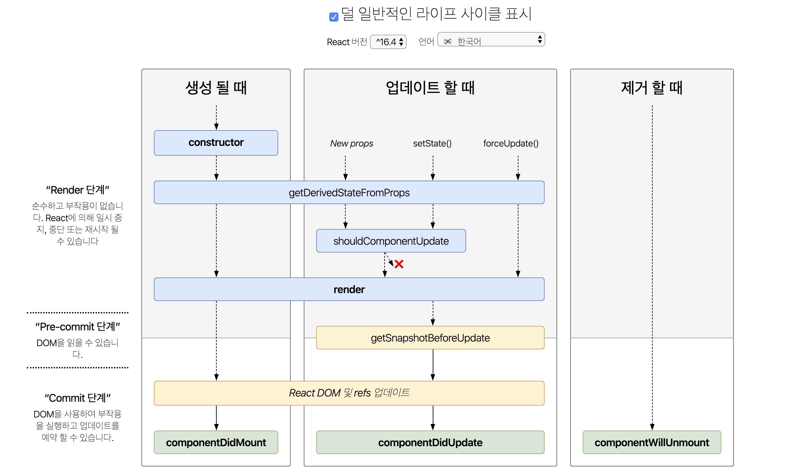

## 리액트

현대의 웹은 사용자와의 상호작용이 많아져 단순한 '문서(Document)' 로서의 역할이 아닌 '웹 애플리케이션' 이 되었습니다. 웹 애플리케이션은 사용자와 상호작용이 많고 이에 따라 많은 상태나 이벤트등을 통해 DOM에 대한 업데이트가 빈번하게 일어나기때문에 브라우저의 성능에 문제가 발생할 수 있고, 애플리케이션 복잡도가 증가하면 여러 상태를 관리해야하는데 이는 쉬운 일이 아닙니다.

리액트는 가상돔(Virtual DOM) 을 이용하는데 간단히 설명하면 기존의 DOM을 추상화하여 복제시킨 DOM을 말합니다. 뷰에 변화가 있을 때 DOM 에 적용되기 전에 가상돔에 먼저 적용시키고 최종적인 변경사항을 실제 DOM 에 적용시켜 브라우저 렌더링 횟수를 줄여 성능향상에 도움을 줍니다.

## 라이프사이클

리액트에서는 컴포넌트들을 이용해 복잡한 애플리케이션을 구성하고, 컴포넌트는 컴포넌트의 생성부터 마지막으로 제거되기까지 일련의 **생명주기(LifeCycle)**를 갖습니다. 생명주기에서는 특정 시점에 호출되는 메서드들이 있고 이를 **'라이프사이클 이벤트'** 라고 합니다. 리액트 컴포넌트의 라이프사이클에 대해 알아봅니다.



리액트 라이프사이클에 대한 도표입니다. 큰 흐름으로는 컴포넌트의 마운트(생성), 업데이트, 마운트 해제(제거) 입니다.

### 마운트

컴포넌트가 DOM 에 생성(Mounting)되기 전까지의 라이프사이클 이벤트들입니다. state 설정에 관련된 작업, 인스턴스 이벤트 메서드 바인딩 작업이 필요할 때 이 단계에서 진행합니다.

#### constructor(props)

constructor 는 class 가 생성될 때 가장 처음으로 한 번 호출됩니다. 컴포넌트의 state 설정이 필요하다면 constructor 에서 진행합니다. 생성할 컴포넌트가 React.Component 를 상속하는 경우라면 super(props) 구문이 constructor 의 가장 첫번째 구문에 와야 합니다.

constructor 에서 주로 하는 작업은 다음과 같습니다.

1. state 초기화
2. 인스턴스에 이벤트 메서드 바인딩

```jsx
import React from 'react'

class Box extends React.Component {
  constructor(props) {
    super(props)
    /* 1. state 초기화 */
    this.state = {
      // ...
    }

    /* 2. 인스턴스에 이벤트 메서드 바인딩 */
    this.onClick = this.onClick.bind(this)
  }

  // 이벤트 메서드
  onClick() {
    console.log(this)
  }
}

export default Box
```

인스턴스 이벤트 메서드는 별도의 this 바인딩 작업이 필요합니다. 바인딩을 하지 않으면 render 이후에 올라간 DOM 에서의 함수 호출에서 this 는 해당 컴포넌트의 인스턴스를 가리키지 않기 때문에 `undefined` 가 값으로 오고 이는 에러로 이어집니다.

굳이 `.bind` 함수를 이용하지 않고 this 만 연결해준다면 다른 방법으로도 가능합니다.

1. 화살표 함수 이용
2. 콜백 화살표 함수

```jsx
class SomeComponent extends React.component {
  handleClick1 = () => {
    // ...
  }
  handleClick2 () {
    // ...
  }

  render() {
    return (
      <button onClick={this.handleClick1}/>
      <button onClick={() => this.handleClick2()}/>
    )
  }
}
```

#### UNSAFE_componentWillMount: 제거 예정

컴포넌트가 DOM 에 삽입되기 직전에 호출됩니다. render 되기 전이므로 setState 를 이용해도 렌더링되지 않습니다.

> 원래 라이프사이클 이벤트 이름은 componentWillMount 였지만 리액트 16.3 이후부터 deprecated 되어 UNSAFE_componentWillMount 로 변경됩니다.

#### static getDerivedStateFromProps(props, state)

최초 생성시와 업데이트시 사용되는 메서드이며, static 이기때문에 this 를 사용할 수 없습니다. 렌더링 될 때마다 매번 실행되므로 유의하여 컴포넌트를 작성해야합니다.
getDerivedStateFromProps 는 props 에 의해 state 가 변경되어야 할 경우인데, 드물게 사용한다고 합니다. 이 라이프사이클 이벤트를 사용하는 경우라면 다음과 같은 경우인지 확인하고, 다른 대안으로 작성하는것을 권장합니다.

- props 변화에 의한 부수효과가 필요한 경우 componentDidUpdate 를 이용합니다.
- props 가 변화했을 때 특정 데이터를 다시 계산하고 싶다면 [Memoization Helper](https://ko.reactjs.org/blog/2018/06/07/you-probably-dont-need-derived-state.html#what-about-memoization)를 이용합니다.
- props 가 변화할 때 일부 state 를 재설정 하고 싶다면, UnControlled Component 와 Controlled Component 로 만들어서 사용합니다.

#### render()

모든 컴포넌트가 필수적으로 구현해야하는 메서드로 return 값으로 다음 네 가지 경우중 하나를 반환해야 합니다.

1. **React 엘리먼트:** JSX 문법으로 작성된 컴포넌트
2. **배열과 Fragment:** 여러개의 React 엘리먼트 반환
3. **Portal:** 루트 노트 외 별도의 DOM 트리에 자식 엘리먼트를 렌더링
4. **문자열 및 숫자:** 텍스트 노드로서 렌더링
5. **Boolean 또는 null:** 아무것도 렌더링 하지 않음

render 함수는 호출될 때마다 동일한 결과를 반환해야 합니다.

#### componentDidMount()

컴포넌트가 DOM 트리에 마운트 된 이후 실행됩니다. 외부에서 데이터를 불러오기 적절한 위치이며, 데이터에 대한 구독도 설정하기 적절한 위치입니다. 데이터 구독시 componentWillUnmount 에서 반드시 구독을 해제해 메모리 누수를 방지해야합니다.

### 업데이트

컴포넌트가 생성되고, props 또는 state 가 업데이트될 때 발생합니다.

#### UNSAFE_componentWillReceiveProps(nextProps): 제거 예정

마운트된 컴포넌트가 새로운 props 를 전달받기 전에 호출됩니다. 이전 props 와 새로 받은 props 를 비교해 setState 를 이용해 state 를 업데이트할 수 있습니다. 하지만 렌더링은 되지 않습니다.

> 원래 라이프사이클 이벤트 이름은 componentWillReceiveProps 였지만 리액트 16.3 이후부터 deprecated 되어 UNSAFE_componentWillReceiveProps 로 변경됩니다.

#### shouldComponentUpdate(nextProps, nextState)

리액트는 props 및 state 가 변경될 때마다 render 함수를 실행하는것을 기본으로 하고있습니다. shouldComponentUpdate 는 boolean 을 return 하는데 true 일 경우 re-render 하고 그렇지 않으면 re-render 하지 않아 성능최적화가 필요한 경우 사용합니다. false 를 return 하는 경우에는 UNSAFE_componentWillUpdate(), render(), componentDidUpdate() 함수는 호출되지 않습니다.

다른 대안으로 PureComponent 를 작성하는 것을 생각해 볼 수 있습니다.

> 깊은 검사를 진행하거나 `JSON.stringify()` 를 이용해 비교하는것은 아주 비효율적입니다.

#### UNSAFE_componentWillUpdate(nextProps, nextState): 제거 예정

초기 렌더링시에는 호출되지 않고, 새로운 props 또는 state 가 전달되고 업데이트를 위한 렌더링이 발생하기 전에 호출됩니다.

> 원래 라이프사이클 이벤트 이름은 componentWillUpdate 였지만 리액트 16.3 이후부터 deprecated 되어 UNSAFE_componentWillUpdate 로 변경됩니다.

#### getSnapshotBeforeUpdate(prevProps, prevStat)

가장 마지막으로 렌더링 된 결과가 DOM 에 반영됐을 때 호출됩니다. 채팅화면의 Scroll 위치 조정할 때처럼 DOM 업데이트 이후 결정된 화면에 대한 조작이 필요할 때 사용합니다. 여기서 return 되는 값은 componentDidUpdate 의 세번째 인자로 전달됩니다.

#### componentDidUpdate(prevProps, prevState, snapshot)

최초 렌더링시에는 호출되지 않고, 업데이트가 일어난 직후에 발생하는 이벤트입니다. DOM 조작이나 이전 props 와 비교해 네트워크 요청을 보낼지 결정하기에 좋은 위치입니다.

컴포넌트에서 getSnapshotBeforeUpdate 를 구현했다면 getSnapshotBeforeUpdate 의 return 값을 세번째 파라미터인 snapshot 으로 가져 올 수 있습니다.

### 마운트 해제

컴포넌트가 DOM 에서 제거(UnMounting) 될 때 발생합니다.

#### componentWillUnmount

컴포넌트가 DOM 에서 제거되기 직전에 호출되는 이벤트입니다. 여기서는 구독해제, 네트워크 요청 취소 등 메모리 누수 방지에 대한 처리를 진행합니다.

## 라이프사이클 요약

위의 `UNSAFE_` 가 붙은 라이프사이클은 16.3 이후 부터 deprecated 되기 때문이고, 아래의 요약은 16.4 이후부터 적용되는 일련의 과정입니다.

1. **마운트**

   - constructor
   - static getDerivedStateFromProps
   - componentDidMount

2. **업데이트**

   - static getDerivedStateFromProps
   - shouldComponentUpdate
   - render
   - getSnapshotBeforeUpdate
   - componentDidUpdate

3. **마운트 해제**
   - componentWillUnmount

> 16.3 에서 static getDerivedStateFromProps 훅은 setState() 나 forceUpdate() 시엔 발생되지 않지만 16.4 부터는 발생합니다.

## 참고문서

- [React](https://ko.reactjs.org/docs/react-component.html)
