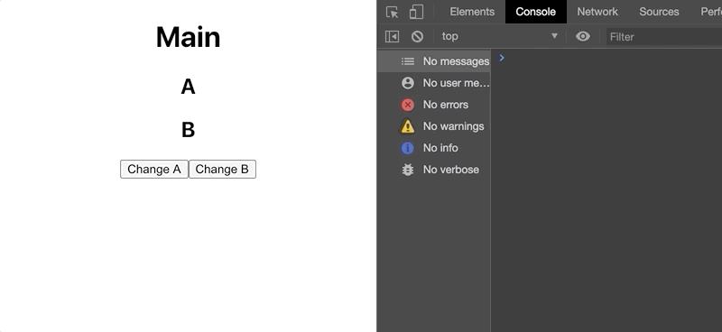
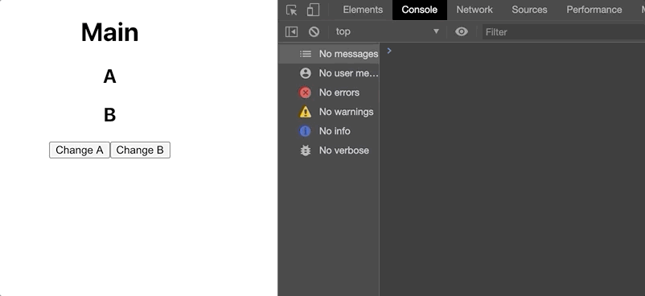
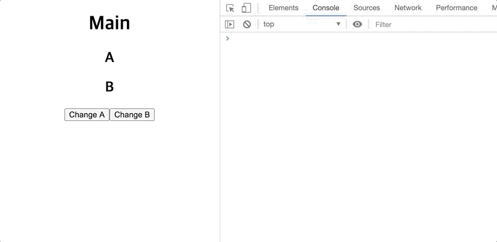
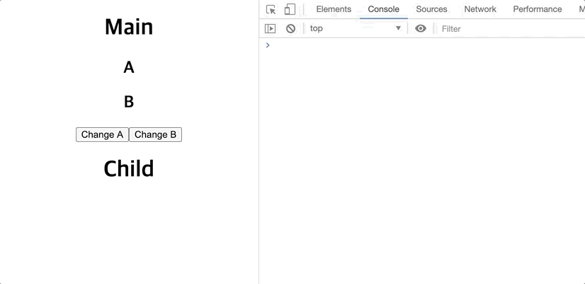
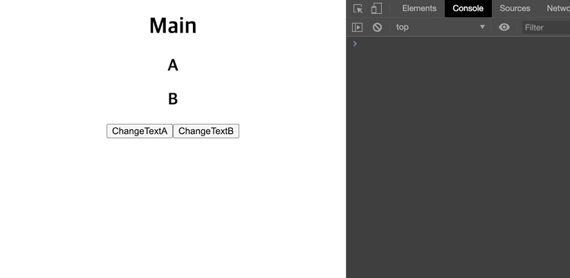
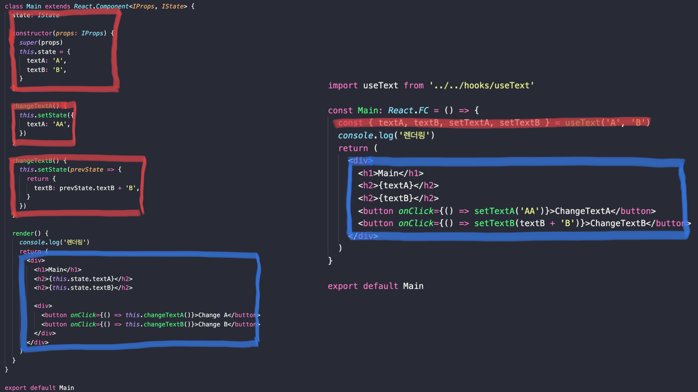

리액트에서 컴포넌트를 정의하는 방법은 Class 컴포넌트와 Functional 컴포넌트로 두가지가 있습니다. Hooks API 는 Functional 컴포넌트에서 사용하는데 이는 Class 컴포넌트를 완전히 대체할 수 있습니다. [리액트가 Hooks 를 만든 이유는 공식 문서에도 나와있지만](https://reactjs.org/docs/hooks-intro.html#motivation) 간단한 예제를 통해 왜 리액트가 Hooks 를 만들게 되었는지 살펴보고싶어 글을 정리하려 합니다. 여기에 사용되는 예제는 타입스크립트를 기반으로 작성되고 있습니다.

## Class 컴포넌트

Class 컴포넌트는 render 함수를 필수적으로 구현해야하며 컴포넌트가 전달받은 props 나 자신의 상태를 나타내는 state 의 변화가 있을 때 호출되어 재 렌더링 됩니다.

다음 Main 컴포넌트는 `textA`, `textB` 를 state 로 가지고 있으며 각 버튼은 state 를 변경하고 있습니다. changeTextA 메서드는 `textA` 의 상태를 `AA` 로 한번만 업데이트를 하고 changeTextB 메서드는 `textB` 의 상태를 계속 업데이트를 진행하는 메서드입니다. 렌더링 함수가 호출될 때마다 '렌더링' 이라는 글자를 로그로 남기는 코드입니다.

```tsx
import React from 'react'

interface IProps {}

interface IState {
  textA: string
  textB: string
}

class Main extends React.Component<IProps, IState> {
  state: IState

  constructor(props: IProps) {
    super(props)
    this.state = {
      textA: 'A',
      textB: 'B',
    }
  }

  changeTextA() {
    this.setState({
      textA: 'AA',
    })
  }

  changeTextB() {
    this.setState(prevState => {
      return {
        textB: prevState.textB + 'B',
      }
    })
  }

  render() {
    console.log('렌더링')
    return (
      <div>
        <h1>Main</h1>
        <h2>{this.state.textA}</h2>
        <h2>{this.state.textB}</h2>

        <div>
          <button onClick={() => this.changeTextA()}>Change A</button>
          <button onClick={() => this.changeTextB()}>Change B</button>
        </div>
      </div>
    )
  }
}

export default Main
```

> setState 는 리액트에서 상태를 업데이트할 때 사용하는 함수이며, 비동기일 수 있는데 이는 리액트가 성능을 위해 여러 업데이트를 한번에 처리할 수 있기 때문입니다. 기존 상태를 기반으로 업데이트할 경우 setState 의 인자로 업데이트 콜백을 넘겨줘야합니다. `(state: IState, props: IProps) => IState` 와 같은 형태의 콜백으로 반환값은 State 입니다. [관련문서 - State를 올바르게 사용하기](https://ko.reactjs.org/docs/state-and-lifecycle.html#using-state-correctly)

### 라이프사이클을 이용한 최적화

Change A 버튼을 계속 누르다보면 의문점이 생깁니다. `textA` 는 상태가 `AA` 로 업데이트 된 이후에 값이 그대로인데 Change A 버튼을 누를때마다 render() 함수를 호출하는것을 볼 수 있습니다.



컴포넌트는 자신이 생성되고 파괴되기까지 일련의 라이프사이클을 갖습니다. 리액트 컴포넌트도 라이프사이클을 갖고 있는데 라이프사이클 훅들중 Props 나 State 가 변경됐을 때 렌더링을 할지 판단해주는 [shouldComponentUpdate 라이프사이클 훅](react-life-cycle#shouldcomponentupdatenextprops-nextstate)을 이용해 A 가 변경되지 않았을 때는 렌더링되지 않게 최적화를 진행합니다.

Main 코드에 다음 코드를 넣습니다.

```tsx
// ...

shouldComponentUpdate(nextProps: IProps, nextState: IState) {
  const changedTextA = this.state.textA !== nextState.textA
  const changedTextB = this.state.textB !== nextState.textB

  return changedTextA || changedTextB
}

// ...
```

위의 코드는 첫번째 인자로 업데이트 될 props 를 받고, 두번째 인자로 업데이트 될 state 를 받습니다. 그리고 textA 와 textB 를 다음 상태의 값과 비교해 렌더링을 할지 여부를 반환해줍니다. 만약 렌더링이 필요하다면 true 를 반환해주고 렌더링이 필요하지 않다면 false 를 반환합니다.

위의 조건은 textA 의 변경점이 있거나 textB 의 변경점이 있다면 렌더링을 해주는 것을 볼 수 있습니다.

위의 코드를 넣은 상태로 Change A 버튼을 누른다면 넣기전 코드와는 다르게 render() 함수를 호출하지 않는 것을 볼 수 있습니다.


### 순수 컴포넌트(Pure Component)를 이용한 최적화

shouldComponentUpdate 를 이용하면 컴포넌트의 세세한 부분들까지 개발자가 비교해 렌더링 여부를 판단할 수 있다는 장점이 있지만 세세하지 않다면 조금 번거로울 수 있는 작업입니다. 리액트는 이를 위해 순수 컴포넌트(Pure Component) 를 제공합니다. [순수 컴포넌트는 props 와 state 를 이용해 얕은 비교를 하고 변화가 있다면 렌더링을 진행합니다.](https://ko.reactjs.org/docs/react-api.html#reactpurecomponent)

Main 코드에서 React.Component 를 상속받던 부분을 React.PureComponent로 다음과 같이 변경해봅니다.

```tsx
import React from 'react'

interface IProps {}

interface IState {
  textA: string
  textB: string
}

/* PureComponent 를 상속 */
class Main extends React.PureComponent<IProps, IState> {
  state: IState

  constructor(props: IProps) {
    super(props)
    this.state = {
      textA: 'A',
      textB: 'B',
    }
  }

  changeTextA() {
    this.setState({
      textA: 'AA',
    })
  }

  changeTextB() {
    this.setState(prevState => {
      return {
        textB: prevState.textB + 'B',
      }
    })
  }

  render() {
    console.log('렌더링')
    return (
      <div>
        <h1>Main</h1>
        <h2>{this.state.textA}</h2>
        <h2>{this.state.textB}</h2>

        <div>
          <button onClick={() => this.changeTextA()}>Change A</button>
          <button onClick={() => this.changeTextB()}>Change B</button>
        </div>
      </div>
    )
  }
}

export default Main
```



순수 컴포넌트로 작성된 Main 컴포넌트의 동작도 동일하게 최적화된 것을 볼 수 있습니다.

## Functional 컴포넌트

위의 Main 예제를 Functional 컴포넌트로 변환을 해보겠습니다. Class 컴포넌트와 처리하는 로직이 어떻게 변경되는지 신경쓰면서 살펴보면 좋을 것 같습니다.

```tsx
import React, { useState } from 'react'

const Main: React.FC = () => {
  const [textA, setTextA] = useState('A')
  const [textB, setTextB] = useState('B')
  console.log('렌더링')

  return (
    <div>
      <h1>Main</h1>
      <h2>{textA}</h2>
      <h2>{textB}</h2>
      <button onClick={() => setTextA('AA')}>Change A</button>
      <button onClick={() => setTextB(textB + 'B')}>Change B</button>
    </div>
  )
}

export default Main
```



Class 컴포넌트를 Functional 컴포넌트로 변환해서 실행한 결과입니다. 다른점은 상태를 갖기 위해 Hooks API 의 useState 를 사용했습니다. setTextA() 함수를 통해 `AA` 로 설정해준 뒤로 '렌더링' 로그가 찍히지 않는것을 볼 수 있습니다.

```tsx
import React from 'react'

const Child: React.FC = () => {
  console.log('Child 렌더링')
  return <h1>Child</h1>
}

export default Child
```

```tsx
import React, { useState } from 'react'
import Child from '../Child'

const Main: React.FC = () => {
  const [textA, setTextA] = useState('A')
  const [textB, setTextB] = useState('B')
  console.log('render')

  return (
    <div>
      <h1>Main</h1>
      <h2>{textA}</h2>
      <h2>{textB}</h2>
      <button onClick={() => setTextA('AA')}>Change A</button>
      <button onClick={() => setTextB(textB + 'B')}>Change B</button>
      <Child />
    </div>
  )
}

export default Main
```

> Change Text A 버튼을 두번째로 눌렀을 때도 '렌더링' 로그가 찍히는것을 볼 수 있는데요. 이것은 [리액트 useState 문서](https://reactjs.org/docs/hooks-reference.html#bailing-out-of-a-state-update)에 설명되어있습니다.<br><br>"Note that React may still need to render that specific component again before bailing out. That shouldn’t be a concern because React won’t unnecessarily go “deeper” into the tree. If you’re doing expensive calculations while rendering, you can optimize them with useMemo."<br><br>리액트 컴포넌트가 렌더링 될 수 있는데 리액트 컴포넌트 트리에서 값이 동일하다면 하위 컴포넌트는 렌더링 되지 않을거라 크게 신경쓰지 않아도 된다라고 나와있습니다. 실제로 Child 컴포넌트를 만들어서 동작시켜보면 렌더링 되지 않는것을 확인 할 수 있습니다.



## 로직의 재사용을 위한 HOC

Class 컴포넌트와 Functional 컴포넌트 예제에서 공통적인 부분이 있습니다. textA 와 textB 상태를 가지고있고 이것들을 각각 업데이트하는 로직이 있습니다. 이 로직이 만약 다른 컴포넌트에서도 사용할 수 있다면 이를 고려해 재사용성을 높이는 방법으로 구현되어야 할 것 같습니다. 재사용되는 로직들을 [HOC(Higher Order Component: 고차 컴포넌트)](https://ko.reactjs.org/docs/higher-order-components.html)를 이용해 구현해봅니다.

먼저 textA 와 textB 그리고 이것들의 상태를 변경하는 changeTextA 와 changeTextB 에 대한 공통 상태와 로직들을 갖는 withText 라는 HOC 를 구현했습니다. Main 컴포넌트는 상태(textA, textB)와 공통로직(changeTextA, changeTextB) 을 props 로 받아 동작시킵니다.

```tsx
import React from 'react'

interface IState {
  textA: string
  textB: string
}

const withText = (
  WrappedComponent: React.ComponentType<{
    textA: string
    textB: string
    changeTextA: () => void
    changeTextB: () => void
  }>
) => {
  return class extends React.Component<{}, IState> {
    state = {
      textA: 'A',
      textB: 'B',
    }

    constructor(props: any) {
      super(props)
      this.changeTextA = this.changeTextA.bind(this)
      this.changeTextB = this.changeTextB.bind(this)
    }

    changeTextA() {
      this.setState({
        textA: 'AA',
      })
    }

    changeTextB() {
      this.setState(prevState => ({
        textB: prevState.textB + 'B',
      }))
    }

    render() {
      return (
        <WrappedComponent
          {...this.state}
          {...{ changeTextA: this.changeTextA, changeTextB: this.changeTextB }}
        />
      )
    }
  }
}

export default withText
```

```tsx
import React from 'react'
import withText from '../withText'

interface IProps {
  textA: string
  textB: string
  changeTextA: () => void
  changeTextB: () => void
}

interface IState {}

class Main extends React.Component<IProps, IState> {
  constructor(props: IProps) {
    super(props)
  }

  render() {
    console.log('렌더링')
    return (
      <div>
        <h1>Main</h1>
        <h2>{this.props.textA}</h2>
        <h2>{this.props.textB}</h2>

        <div>
          <button onClick={() => this.props.changeTextA()}>Change A</button>
          <button onClick={() => this.props.changeTextB()}>Change B</button>
        </div>
      </div>
    )
  }
}

export default withText(Main)
```


HOC 를 이용해 동일하게 동작하는 것을 볼 수 있습니다. 해당 예제에 대해 렌더링 최적화를 하고싶다면 이전에 사용했던 shouldComponentUpdate 를 이용하거나 PureComponent 를 상속받아 구현하면 됩니다.

### 문제점

HOC 를 이용해 '네트워크를 통해 데이터를 받는 로직', '현재 페이지의 스크롤을 구독', '데이터 CRUD(생성, 조회, 업데이트, 삭제)' 등 컴포넌트 라이프사이클 훅에 이런 로직들을 넣는 경우가 많은데 이를 공통화하여 HOC 로 분리해두고 가져다 사용할 수 있습니다. 하지만 [이를 사용하는 컴포넌트는 HOC 로 인해 컴포넌트 트리가 중첩(Wrapper Hell)되어 코드 추적과 리팩토링 및 테스트의 어려움이 발생할 수 있습니다.](https://ko.reactjs.org/docs/hooks-intro.html#motivation)

## Hooks

리액트 Hooks 를 이용하면 HOC 를 이용하지 않고 간결하게 로직을 재사용할 수 있습니다. 위에서 적용했던 HOC 예제를 Custom Hook 을 만들어 리팩토링해보겠습니다.

textA, textB 상태와 각각 업데이트 함수를 반환해주는 useText 라는 Custom Hook 을 만들어줍니다. 그리고 사용되는 컴포넌트에서는 앞서 만든 훅을 호출해주고 [디스트럭쳐링](https://developer.mozilla.org/ko/docs/Web/JavaScript/Reference/Operators/Destructuring_assignment)으로 상태들과 업데이트 함수들을 가져와 적용시켜줍니다.

```tsx
import { useState } from 'react'

function useText(initTextA: string = '', initTextB: string = '') {
  const [textA, setTextA] = useState(initTextA)
  const [textB, setTextB] = useState(initTextB)

  return {
    textA,
    textB,
    setTextA,
    setTextB,
  }
}

export default useText
```

```tsx
import useText from '../../hooks/useText'

const Main: React.FC = () => {
  const { textA, textB, setTextA, setTextB } = useText('A', 'B')
  console.log('렌더링')
  return (
    <div>
      <h1>Main</h1>
      <h2>{textA}</h2>
      <h2>{textB}</h2>
      <button onClick={() => setTextA('AA')}>ChangeTextA</button>
      <button onClick={() => setTextB(textB + 'B')}>ChangeTextB</button>
    </div>
  )
}

export default Main
```



Hooks를 이용해 단순한 함수호출로 변경되었습니다. HOC 는 로직의 재사용을 위해 중첩된 구조의 컴포넌트 트리를 만들었었는데 보다 간결해진 코드를 확인할 수 있습니다. 이제 Main 컴포넌트에서는 상태를 표현하고 어떤 상황에 상태를 업데이트시켜야 하는지에 대해서만 신경쓰면 됩니다. 상태의 초기화나 실제 업데이트가 어떻게 이루어지는지는 Hooks 에서 관리를 하기 때문입니다.



빨간색은 상태와 상태 업데이트를 위한 로직을 나타내는 부분이고, 파란색은 렌더링 되는 부분입니다. 리액트의 Class 컴포넌트에서 Hooks 까지의 리팩토링을 통해 코드가 얼마나 간결해졌는지 보여주는 결과입니다.

## 참조

- [Making Sense of React Hooks](https://medium.com/@dan_abramov/making-sense-of-react-hooks-fdbde8803889)
