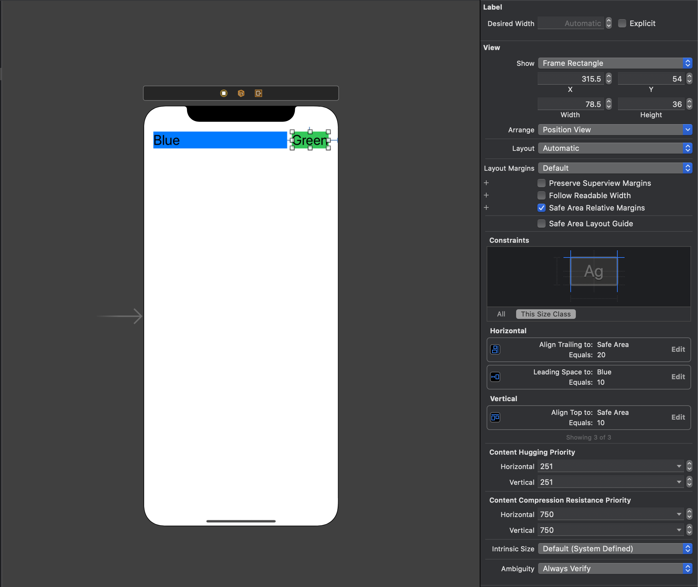
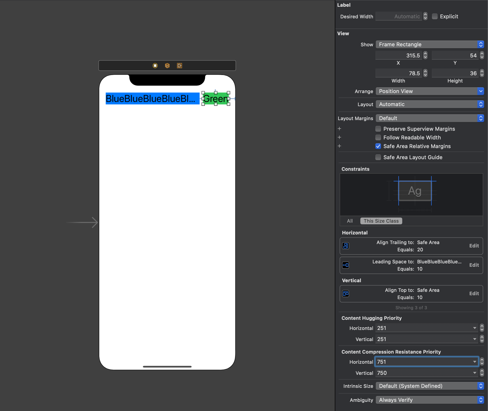

## Intrinsic Content Size (콘텐츠 고유 크기)

UIView 를 만드는데 width 나 height 값을 정해주지 않으면 제약조건에 대한 에러가 발생했는데, Label 이나 Button 과 같은 뷰를 생성할 때는 에러가 나지 않습니다. 이는 각 뷰마다 고유의 크기를 갖는 여부에 따라 다르기 때문인데 [Auto Layout Guide](https://developer.apple.com/library/archive/documentation/UserExperience/Conceptual/AutolayoutPG/AnatomyofaConstraint.html#//apple_ref/doc/uid/TP40010853-CH9-SW1) 에 어떤 뷰가 고유의 크기를 갖는지 명세가 나와있습니다.

- **UIView, NSView**: 고유의 Width 나 Height 를 갖지 않음
- **Sliders**: iOS인 경우 Width 값만 정의 됨, 슬라이더 유형에 따라 Width, Height 존재
- **Labels, Buttons, Switches, TextFields**: Width 와 Height 존재
- **TextView, ImageView**: 텍스트나 이미지의 사이즈에 따라 Width, Height 가 결정

## Content Hugging (최대크기 제약)


콘텐츠를 안는다(Hugging) 는 의미로 특정 값 이상으로 커지기를 거부합니다. 최대 크기를 제약한다는 것은 다른 요소의 크기가 충분히 커진 이후에 자신의 크기를 키웁니다.

- **ContentHugging 우선순위가 높다**: 화면이 커져도 이 뷰는 유지하고 싶을 때
- **ContentHugging 우선순위가 낮다**: 화면이 커지면 이 뷰를 화면에 맞춰 늘리고 싶을 때

Content Hugging 을 코드로 표현하면 다음과 같습니다. IntrinsicHeight 및 IntrinsicWidth 는 뷰의 고유 컨텐츠 크기에서 높이 및 너비 값을 나타냅니다.

```swift
// Content Hugging
View.height <= 0.0 * NotAnAttribute + IntrinsicHeight
View.width <= 0.0 * NotAnAttribute + IntrinsicWidth
```



Green 의 Content Hugging 의 Priority 값이 Blue 보다 높기때문에, Blue가 충분히 커진 이후 Green 이 커집니다.

## Compression Resistance (최소크기 제약)

직역하면 '압축 저항' 으로 작아지기를 거부합니다. 우선순위 값이 높다면 다른 요소들이 충분히 작아진 이후에 요소가 작아집니다.

- **ContentResistance 우선순위가 높다**: 화면이 작아져도 이 뷰를 유지하고 싶을 때
- **ContentResistance 우선순위가 낮다**: 화면이 작아지면 이 뷰도 화면에 맞춰 줄이고 싶을 때

Content Resistance 를 코드로 표현하면 다음과 같습니다.

```swift
// Compression Resistance
View.height >= 0.0 * NotAnAttribute + IntrinsicHeight
View.width >= 0.0 * NotAnAttribute + IntrinsicWidth
```



Green 의 Content Resistance 의 Priority 값이 Blue 보다 높기때문에, Blue 가 충분히 작아진 이후에 Green 이 작아집니다.

## Constraint Inequalities (부등식 제약조건)

[Auto Layout 첫번째](/post/swift-autolayout-첫번째) 에서 width 값이 _'같다( = )'_ 라는 조건만 가지고 레이아웃을 결정했습니다. 부등식 제약조건을 이용하면 콘텐츠의 최소(min), 최대(max)사이즈를 조절할 수 있습니다.

```swift
// 최소 너비 설정
View.width >= 0.0 * NotAnAttribute + 40.0

// 최대 너비 설정
View.width <= 0.0 * NotAnAttribute + 280.0
```

하나의 부등식을 두개의 부등식으로 변경할 수 있습니다. 하지만, 두개가 완전히 대칭되지는 않습니다.

```swift
// 하나의 부등식
Blue.leading = 1.0 * Red.trailing + 8.0

// 다음 두개로 교체 가능
Blue.leading >= 1.0 * Red.trailing + 8.0
Blue.leading <= 1.0 * Red.trailing + 8.0
```

두개로 교체된 부분은 너비를 지정했지, 위치나 크기를 지정한 것은 아니므로 추가적인 수평 제약조건이 필요합니다.

## Priority (우선순위)

지금까지 살펴본 Priority 값은 1 ~ 1000 까지의 범위를 갖을 수 있습니다. 다 사용되는 것은 아니고 보통 4가지로 나뉘어 사용합니다.

- 낮음: 250
- 중간: 500
- 높음: 750
- 필수: 1000

같은 단계에서 조금 더 우선순위를 조정한다면 1이나 2정도 더 줘서 우선순위를 결정해 줄 수 있습니다.

## 참고문서

- [Apple AutoLayout Guide](https://developer.apple.com/library/archive/documentation/UserExperience/Conceptual/AutolayoutPG/AnatomyofaConstraint.html#//apple_ref/doc/uid/TP40010853-CH9-SW1)
- [iOS: Content Hugging, Compression Resistance Priority - 꿀벌개발일지](https://ohgyun.com/734)
- [Auto Layout Guide 따라잡기 - 주희하세요!](https://caution-dev.github.io/apple-docs/2019/04/17/Auto-Layout-Giuide-Getting-Started-3.html)
