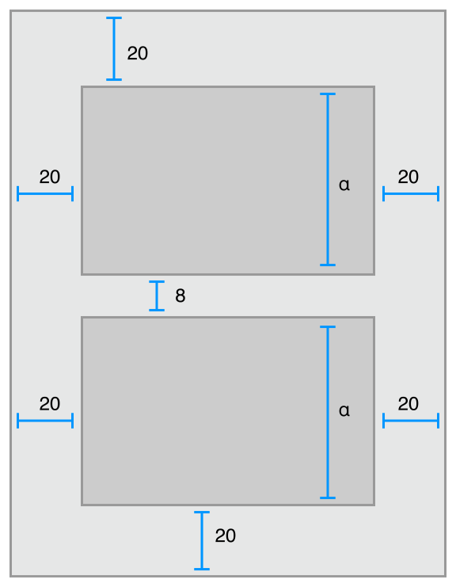
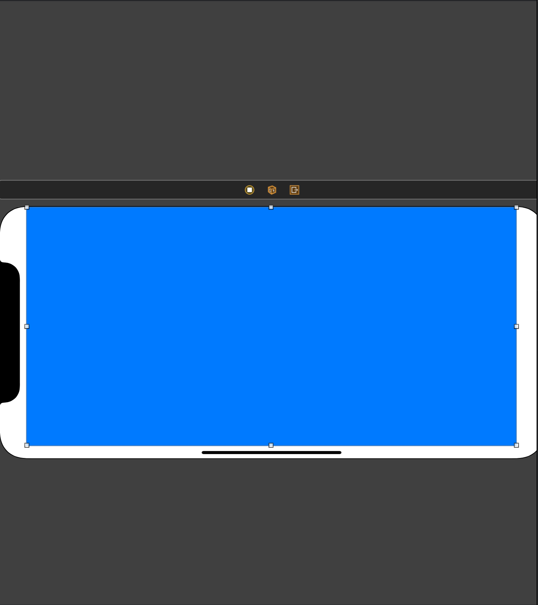
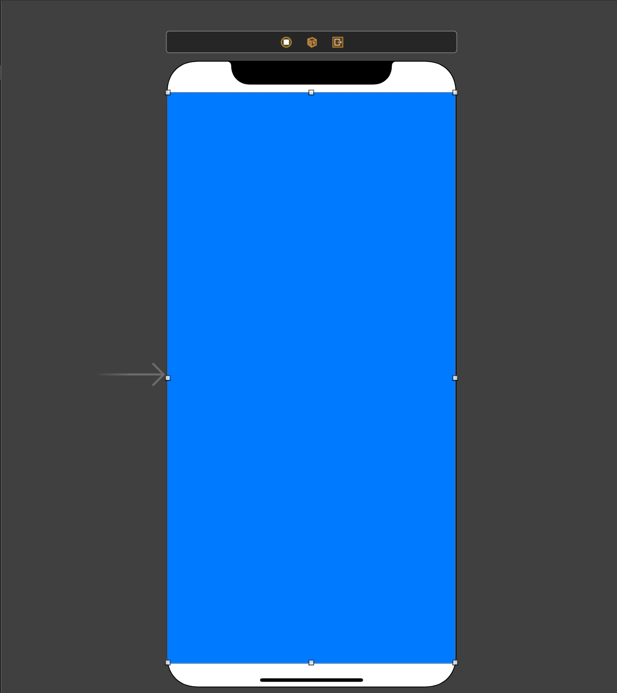
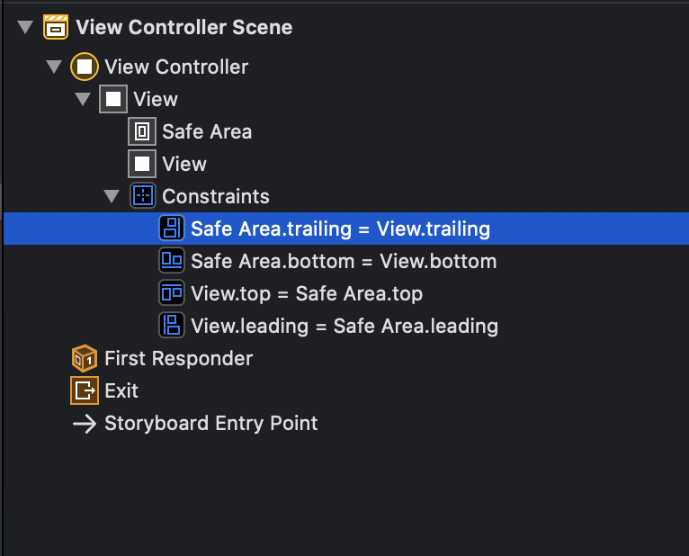
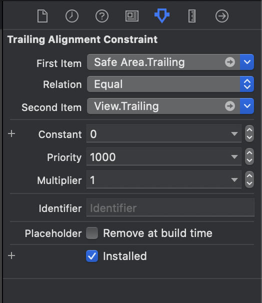
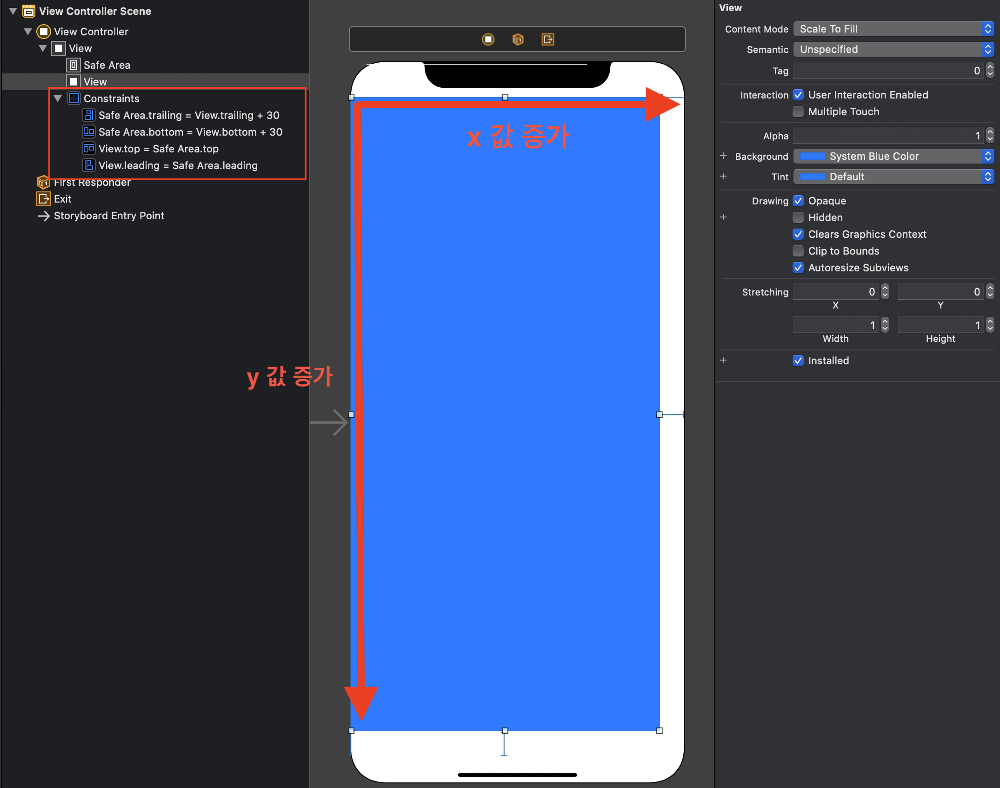
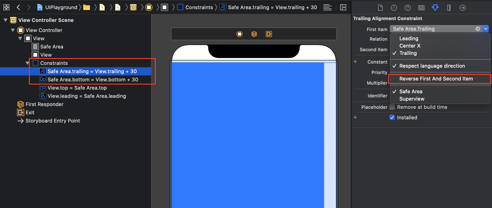
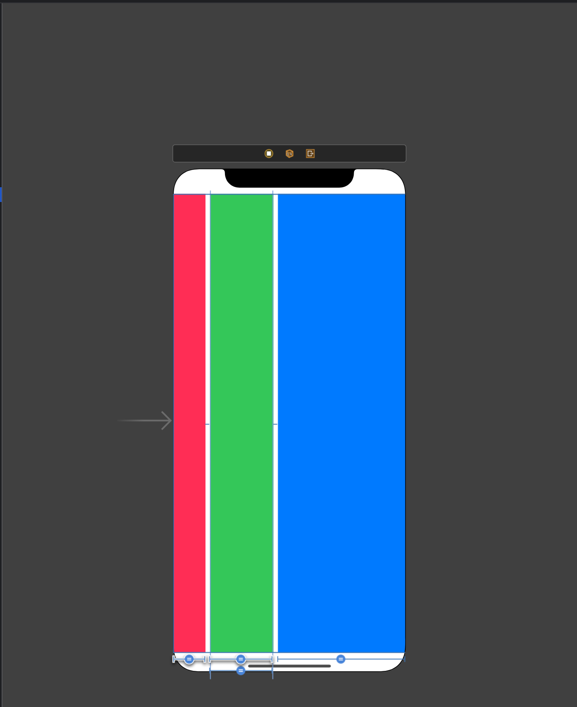

```toc
```

## Frame-based Layout

AutoLayout 이 나오기 이전에는 Frame-based Layout(프레임 기반 레이아웃) 으로 그렸습니다. 프레임 기반 레이아웃은 단순히 뷰에 대해 좌표를 설정하고 길이와 높이를 정해주면 되지만, 기기가 Landscape 모드로 돌아가게 되면 기존에 유지했던 레이아웃을 기대하기 어렵습니다. 


## Auto Layout

Auto Layout 은 뷰를 계층구조로 나누고 뷰와 뷰 사이의 제약조건들(constraints)을 통해 레이아웃을 동적으로 계산하는 방식입니다. 요즘에는 디바이스의 종류들이 많습니다. iOS만 하더라도 iPad 부터 iPhone 이 세대별로, 화면 사이즈별, 해상도별로 나옵니다. AutoLayout 은 여러 디바이스들에 대응되는 레이아웃들을 매 번 그리지 않아도 뷰들의 제약조건들을 통해 자동으로 그려주어 유지보수 측면에서 상당히 이점이 있습니다.



> Auto Layout 을 간단히 맛본 생각으로는 CSS 의 Flex Layout 을 옮겨놓은 듯한 느낌을 받았습니다.

## Constraints 를 알아보자

뷰 계층의 레이아웃은 선형 방정식(linear equation) 으로 정의 됩니다.

> 선형방정식을 간단히 설명하자면 일차항으로만 이루어진 수식을 말합니다.


애플 개발자 문서의 예제입니다. BlueView 와 RedView 가 AutoLayout 으로 위치해 있는데 이 둘 사이의 관계를 아래의 코드로 나타낼 수 있습니다. 반대로 생각하면 레이아웃을 짤 때 프로그래밍 방식을 이용해 아래의 코드 입력하면 위와 같은 관계를 갖습니다. 

- Item1: RedView
- Item2: BlueView
- Attribute1: Item1 의 속성
- Attribute2: Item2의 속성
- Relationship: 관계에 대한 값 (=, ≤, ≥ 중 하나의 수식)
- Multiplier: Item1 과 Item2 사이의 비율을 나타냅니다.
- Constant:  상수 값

### Auto Layout 속성

CSS 처럼 위, 아래, 왼쪽, 오른쪽을 나타내는 값들이 있습니다. Swift AutoLayout 에서 각 속성들을 표현한 그림입니다. CSS 의 속성과 조금 다르게 보이는 항목이 Leading(선행) 과 Trailing(후행) 인데, Left 또는 Right 으로 표현을 하고 있습니다.

> Xcode 에서는 Leading 과 Trailing 이라고 표현되네요


### 방정식이 View 로 적용되는 원리

```plainText
FirstItem.attribute = Multiplier * SecondItem.attribute + Constant
```

여기서 = 는 프로그래밍에서 할당의 의미가 아니라 평등을 의미합니다.
 
*"Item1의 attribute 는 Item2의 attribute 에서 multiplier 비율만큼 곱해진 값에서 constant 를 더한만큼이야."* 라고 표현되는것이죠.
이런 값들을 Xcode 에서 살펴볼 수 있습니다. 

위 이미지는 위아래 양옆으로 꽉찬 뷰입니다. 이 뷰는 이는 constraints 를 걸어주었기 때문에 rotate 를 시켜도 꽉찬 화면을 유지합니다.









Xcode는 위의 View 에 대한 제약사항을 다음과 같이 표현합니다.

SafeArea.trailing = View.trailing 이라고 나와있고, 아래에는 FirstItem, Relation, SecondItem 등등으로 값을 설정할 수 있습니다. 이중에 아까의 방정식에 나온 값들만 정리해서 살펴봅니다.

*SafeArea 의 선행과 뷰의 후행의 위치가 같다.* 라고 표현될 수 있습니다. multiplier 와 constant 는 값이 없어 생략되었습니다.

### SafeArea 가 무엇인가요?


SafeArea 는 iPhoneX 와 같이 노치디자인(Notch Design)이 적용된 풀스크린을 제공하는 기기에서 콘텐츠가 겹쳐지거나 사용자의 행동을 방해하지 않는 안전한 영역을 말합니다. 


### 왜 평등하다는 표현이 앞뒤가 다른가요?


같다는 표현이 Trailing 과 Bottom 은 다르게 표현됩니다. 이 이유는 Constant 를 양수로 처리하기 위하는 것으로 보입니다. 

현재는 Constant 값을 0 으로 설정해서 양수,음수가 판별이 되지 않지만 Trailing 이나 Bottom 은 View 보다 상단에 존재하는 SafeArea 가 위치값이 더 적기 때문에 반대로 설정하면 음수가 나오게됩니다.




위의 이미지는 View 의 trailing 값과 bottom 값이 30만큼 떨어져있고, x 와 y의 증가방향을 보면 SafeArea 의 trailing 과 bottom 값이 크다는것을 알 수 있고, 이를 통해 다음 두개의 수식은 동일합니다.

```
1. SafeArea.trailing = View.trailing + 특정값
2. View.trailing = SafeArea.trailing - 특정값
```

2번의 수식처럼 반대로 표현해서 통일성을 주고싶다면 **Reverse First And Second Item** 을 눌러주면 됩니다.



### Multiplier



Multiplier 를 이용해 간단히 일정 비율을 나눠가진 레이아웃을 잡아보겠습니다. 
먼저 Red, Blue, Green View 세개의 제약조건들에 대해 살펴보면 다음과 같습니다.

**Red**

* Red.leading = SafeArea.leading (왼쪽)
* Red.top  = SafeArea.top (위)
* SafeArea.bottom = Red.bottom (아래)
* Green.leading = Red.trailing + 8 (오른쪽)

**Green**

* Green.leading = Red.trailing + 8 (왼쪽, Red의 오른쪽과 동일)
* Green.top  = SafeArea.top (위)
* Green.bottom = SafeArea.bottom (아래)
* Blue.leading  = Green.trailing + 8 (오른쪽)

**Blue**

* Blue.leading = Green.trailing + 8 (왼쪽, Green의 오른쪽과 동일)
* Blue.top = SafeArea.top (위)
* Blue.bottom = SafeArea.bottom (아래)
* SafeArea.trailing = Blue.trailing (오른쪽)

여기까지 제약조건을 걸게되면 아래와 같은 제약조건 관련 에러가 발생합니다. 

```plainText
Needed constraints for: Xposition or width
```

X축 위치나 width 값이 필요하다는 내용인데 이는 Red, Green, Blue 뷰중 어느 하나도 width 값을 갖지 않아서 발생하는 에러입니다. 
먼저, 에러를 잡기 위해서는 3개의 뷰중 하나의 width 값에 대해 관계를 지정해주면 됩니다. 예를들어, Green.width = Blue.width 와 같이 말이죠.

이미지와 같이 1:2:3 의 비율을 갖는 뷰를 얻고싶다면 Red 와 Green 에 1:2 비율로 multiplier 를 적용해줍니다.

```plaintext
1:2 = Red:Green
=> 2 * Red = Green
=> Red = 0.5 * Green
```

```plaintext
1:2 = Green : Blue
=> 2 * Green = Blue
=> Green = 0.5 * Blue
```

* Red.width = 0.5 * Green.width
* Green.width = 0.5 * Blue.width 

> constraints 의 multiplier 값에 비율을 적어줘도 되고, 곱하려는 수를 적어줘도 무방합니다. 여기서는 비율로 작성했습니다. (= 1:2)


## 참고문서

* [Apple AutoLayout Guide](https://developer.apple.com/library/archive/documentation/UserExperience/Conceptual/AutolayoutPG/index.html#//apple_ref/doc/uid/TP40010853-CH7-SW1)
* [iOS:AutoLayout - Zedd0202](https://zeddios.tistory.com/)
* [IOS 오토레이아웃 - 제약조건 구조 ( ANATOMY OF A CONSTRAINT )](https://rhino-developer.tistory.com/entry/iOS-%EC%98%A4%ED%86%A0%EB%A0%88%EC%9D%B4%EC%95%84%EC%9B%83-%EC%A0%9C%EC%95%BD%EC%A1%B0%EA%B1%B4-%EA%B5%AC%EC%A1%B0-Anatomy-of-a-Constraint)
