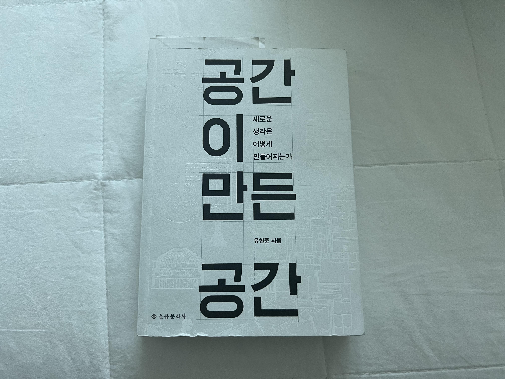

여름즈음 인테리어를 진행하면서 공간에 대한 관심이 많아졌습니다. '공간' 의 사전적 의미로는 '아무것도 없이 비어 있는 곳' 을 말합니다. 우리는 이 '공간'을 어떻게 사용해야 효율적이고 자신의 감성에 맞게 꾸밀 수 있는지 등 인터넷을 찾아보기도 하고 '오늘의 집'의 온라인 집들이를 하며 레퍼런스를 찾아보곤 합니다. 게다가 지금까지 코로나19로 인해 집에 있는 시간이 많아졌고 재택근무로 전환하며 홈피스(홈 + 오피스)를 꾸미는 일도 고민해보게 됩니다.

건축가 '유현준' 교수님의 ['셜록현준'](https://www.youtube.com/channel/UC7uDyFIqExDnfXAIZqumFrQ) 이라는 채널을 알고리즘에 의해 알게 되었는데 "건축으로 바라보는 세상은 어떻게 보여지는가?"에 대한 이야기를 많이 하십니다. 흥미롭게 보고 있던 와중 홍보로 '공간이 만든 공간' 이라는 책을 알게되었고 서점에서 바로 구매해 읽었습니다.

2021년 10월 3일에 사서 이제야 다 읽었지만, 너무 재밌게 읽어 이 책에서 배운것과 느낀점을 써보려 합니다.

## 문화의 시작

동양의 문화와 서양의 문화는 서로 다릅니다. 동양은 자연과 어우르는 문화를 닮았고, 서양은 자연을 거스르는 문화와 닮았습니다. 예를들어 동양에서는 '폭포' 를 좋아했는데 중력을 거스르지 않고 그대로 흐르는 것을 '미'의 상징이라고 여겼습니다. 반대로 서양은 '분수'를 좋아했는데 이는 중력을 거스르는 것을 의미합니다.

이처럼 동양과 서양은 다른 문화를 가졌는데 어떤 이유로 문화가 달라졌을까요?

### 농업의 시작

원시사회에서 인간은 수렵과 채집을 하고 살곤 했습니다. 그러다가 물이 부족해지면서 물이 형성된 지역에 많은 사람이 모여살곤 했습니다. 그런데 많은 사람들이 모여사는데 인간은 활동반경이 그리 넓지 않습니다. 이로인해 수렵과 채집에 한계가 있게 되어 농사라는것을 짓게 됩니다. 농사를 지으면서 식량을 축적할 수 있게 되었습니다. 남는 잉여농산물을 이용해 사회계급이 생겨나고 사회 계층으로 인해 잉여시간이 생겨나 문화가 생겨나기 시작합니다.

그런데 농업을 가장 처음 시작한건 인간이 아닙니다. 인간은 농사를 지은 지 약 1만년정도밖에 되지 않았지만, 개미는 2500만년 전부터 농사를 지었다고합니다. 군집생활을 하는 개미의 종류 중 하나인 '잎꾼 개미'는 잎을 잘라 버섯을 재배해 식량을 축적합니다. 개미도 여왕개미가 있듯이 인간사회에서도 농사를 통해 사회계급이 생겨난 것을 알 수 있습니다.

> 잎꾼개미  
> [출처: 6500만년을 누빈 농사의 신, 잎꾼개미 - 네이버포스트(동그람이)](https://m.post.naver.com/viewer/postView.nhn?volumeNo=9726028&memberNo=38419283)

> 모든 개미가 농사를 짓는 것은 아니지만 개미와 인간을 미루어볼 때 고밀도 군집생활을 하지 않는 생물은 농사를 짓진 않는다고 합니다.

농사를 짓지 않지만 군집생활을 하는 '벌'도 있습니다. 벌은 왜 농사를 짓지 않을까요?

벌은 개미와 반대로 이동수단인 '날개'가 있습니다. 그렇기 떄문에 '개미' 한 마리가 다닐 수 있는 면적과 날개를 통해 날아다니는 '벌'의 활동범위는 천지차이입니다. 그렇기 때문에 벌은 농사를 지을 필요가 없습니다. 동일한 예로, 농사를 짓지 않는 민족이 있습니다. 바로 '몽골 민족' 입니다. 몽골 민족은 말을 타고 수렵과 채집을 하기 때문에 벌과 마찬가지로 이용할 수 있는 공간이 더 넓어지기 때문에 농사를 지을 필요가 없어 유목민족이 된 것 입니다.

농업이 시작됨에 따라 사람이 모여살기 시작하며 사회계급이 생기고, 문명이 발달하게 됩니다. 그런데 왜 서양과 동양의 문화가 농업의 시작과 관련이 있을까요?

### 벼농사와 밀농사

일반적으로 동양은 벼농사를 짓고, 서양에서는 밀농사를 짓습니다. 이를 구분짓는 것은 기후입니다.
연간 강수량이 1000mm 이상이면 벼농사를 하며, 1000mm 이하이면 밀농사를 짓습니다. 두 품종은 재배법이 다릅니다.

**벼농사**  
벼를 재배하기 위해서는 물이 많이 필요합니다. 원활하게 재배를 하기 위해서는 홍수나 가뭄이라는 자연재해를 극복해야합니다. 때문에, 물을 제어하기 위해 저수지 등의 토목공사가 필요했고 모종을 심을 때도 선을 맞추어 일정간격으로 심어야하는데 혼자만의 힘으로는 할 수 없기 때문에 여럿이서 힘을 모아 일을 해야합니다. 이로 인해 협업이 중요해졌으며 관계에 대해 중요시 여기게 됩니다.

**밀농사**  
밀은 벼농사와 반대로 물이 많이 필요하지 않습니다. 씨를 뿌리는 모습만 보더라도 벼농사와 다르게 혼자 뿌릴 수 있습니다. 그래서 굳이 사람끼리 모여서 농사를 짓지 않아도 됩니다. 이로 인해 개인주의 성격이 발달하게 됩니다.

> 기차, 버스, 철길 중 둘을 묶는다면?
> 관계를 중요시 하는 동양에서는 기차와 철길을 하나로 묶고, 개인주의 성격이 강한 서양에서는 기차와 버스를 하나로 묶는 비율이 높다고 합니다.

위의 벼농사와 밀농사의 차이로 동양과 서양의 문화가 다르게 나타납니다.

동양에서는 관계를 중요시하게 여기기 때문에 여러 문자를 조합하는 문자인 '한자' 가 탄생했고, 바둑과 같이 여럿이서 힘을 합쳐서 이기는 게임이 탄생합니다.
반대로 서양에서는 개인주의가 발달하기 때문에 풀어쓰기 문자인 '알파벳'이 탄생하고 바둑과 반대인 체스는 말 하나가 다른 말을 잡을 수 있는 게임이 됩니다.

위의 벼농사와 밀농사가 건축에 어떤 영향을 끼칠까요?

### 건축의 차이

#### 동양

> 출처: 한옥 - 나무위키

벼농사는 연간 강수량이 1000mm 이상이기 때문에 땅이 비교적 무릅니다. 비가 많이 오기 때문에 땅이 물러서 무거운 건축자재를 이용할 수 없어 '목재'를 이용하게 됩니다. 비가 많이 오니 '지붕'이 중요해졌으며 나무는 물에 약하기 때문에 습기를 피해야해서 길게 늘어뜨린 '처마'가 발달했고 '주춧돌'을 이용해 땅에서 일정거리 띄워 짓게 되는 형태가 됩니다.

#### 서양

> 출처: 괴베클리 페테 - 나무위키

밀농사는 연간 강수량이 1000mm 미만이기 때문에 땅이 비교적 단단합니다. 이로 인해 동양보다 무거운 재료를 사용할 수 있게 됩니다. 그래서 무거운 건축재료인 '돌'을 사용할 수 있게 됩니다. 그리고 비가 많이 오지 않고 건축자재도 무겁기 때문에 '지붕'은 중요한 건축요소가 아니게 됩니다. 돌을 쌓는 방식 때문에 '벽' 이라는 공간분리가 생기게 되는데 이로인해 가장 오래된 건축물은 지붕이 없는 형태로 생겨납니다.

### 서양의 조각과 동양의 풍수지리

#### 서양의 조각

서양은 건축자재로 무거운 돌을 이용하기 때문에 벽이 생겨납니다. 이렇게 되면 바깥쪽과 안쪽의 공간이 완벽히 분리가 됩니다. 무거운 돌로 짓다보니 창문을 내는것이 굉장히 어려운 기술입니다. 창을 크게 내면 무게를 지탱하지 못해 무너지기 때문입니다. 그래서 서양은 바깥에서 안을 볼 수 없고, 안은 밖을 보는데 한계가 있습니다. 이로 인해 서양은 건축물 자체에 '미'를 더하게 됩니다. 바깥쪽에서는 건물이 아름답게 보여야 하기 때문에 입면을 조각하게 되며, 안쪽에 있는 사람들도 바깥을 보는데 한계가 있다보니 내부에 조각을 중요하게 여기게 됩니다.

#### 동양의 풍수지리

동양은 가벼운 건축자재를 이용해 짓기 때문에 내구성이 '돌'보다 좋진 않습니다. 홍수가 일어나면 쉽게 건물이 무너질 수 있으니 건축하기 좋은 위치를 선정해야고 비가 많이 와 지붕을 크게 지어야 해서 동양의 건축에는 지붕이 가장 큰 요소가 됩니다. 지붕을 받치기 위해서는 벽이 필요 없기 때문에 기둥을 이용합니다. 벽이 없기 때문에 외부에서는 내부를 볼 수 있고 내부에서는 외부를 바라볼 수 있게 됩니다. 안에서 밖을 볼 일이 많기 때문에 자연경관과의 관계를 중요시 여기게 됩니다.

- 건물의 뒤에 산고 앞으로 강이 흘러야 한다. (= 배산임수) 👉 물이 아래로 잘 배수되어 침수되지 않는다.
- 남쪽을 향해 창이 열려야한다. 👉 채광과 건조

이를 대표적으로 보여주는 것이 단청입니다.

단청의 색상은 외부에서 바라보면 어색합니다. 하지만 동양의 건축은 안에서 밖을 바라볼 때 진국을 발휘합니다. 안에서 단청을 통해 밖을 바라보면 마치 액자처럼 녹색, 적색, 자주색의 명도높은 색상들이 자연경관의 연장선처럼 보입니다. 그래서 한옥은 외부에서 찍는것보다 내부에서 외부를 찍는것이 더 아릅답게 보입니다.

> 출처: [한국문화연수원](http://budcc.com/)

즉, 서양은 건축물이 무거운 재료로 있기 때문에 건축물 자체에 의미를 두어 중요시여기고 동양은 건축물에 의미를 두는것이 아니라 건축물안에서 자연경관을 바라보는 관계를 중시하게 됩니다.

> 상대적으로 오래된 건축물은 동양보다 서양이 많은데 그 이유는 이러한 강수량의 차이로 인해 건축재료도 다르고 건축물 자체에 대한 생각도 다르기 때문에 비교적 서양이 더 오래된 건축물이 많습니다.

## 문화의 융합

### 삼각돛

이렇게 동양과 서양의 건축이 달라지게 되었는데 어떻게 융합이 되었을까요?

처음에는 동양과 서양을 이어주는 길인 '실크로드'를 통해 무역을 해왔습니다. 낙타에 짐을 싣고 다니다 보니 가볍고 깨지지 않는 비싼 물건이어야 했습니다. 이에 해당되는 것이 비단과 향신료입니다. 고대 그리스 시대의 사람들은 흰 옷만 입다가 동양의 형형색색의 비단을 수입해왔습니다. 그런데 이는 공급이 적다보니 귀족들의 문화만으로 자리잡았습니다.

그러다 삼각돛 이라는것이 발명되어서 대항해 시대가 열리게 됩니다. 배는 낙타보다 훨씬 많은 짐을 실을 수 있으며 더 많은 양을 나를 수 있습니다. 게다가 깨지기 쉬운 품목들도 나를 수 있게 되어 무역이 활발해졌습니다.

### 도자기로 배운 새로운 정원

삼각돛이 발명되어 대항해 시대가 열리면서 서양은 동양의 도자기를 수입해옵니다. 이전의 서양의 식기들을 보면 모두 금속이었습니다. 금속에는 문양을 넣기도 어려울 뿐더러 무겁습니다. 그러나 도자기는 문양도 가지각색이며 가볍기까지 합니다. 서양입장에서는 놀라운 신문물이었습니다.

도자기의 유려한 곡선과 화려한 문양들은 서양사람들을 자극했습니다. 서양의 전통적인 건축과 조경은 기하학에 기반했습니다. 수학공식이 완벽한 황금비율이라 생각하여 여태까지 직선으로 이루어진 세상들 뿐이었습니다. 그러던 중 도자기의 유려한 곡선과 문양들이 서서히 서양의 문화에 전파되기 시작합니다.

#### 정원

정원은 자연을 어디서나 보고싶어 만든 공간인데, 역설적이게도 서양의 정원은 기하학적인 형태로 표현됩니다. 그러나 동양의 문화를 받아들이면서 기하학적인 형태에서 '픽처레스크(picturesque)' 정원 디자인으로 변하게 됩니다. 이를 대표적으로 보여주는것이 뉴욕의 '센트럴 파크' 입니다. 센트럴 파크는 높낮이에 따라 보이는 경관이 달라지며, 곡선들의 형태로 이루어져 있으며 자연을 실제로 옮겨놓은 듯한 형태로 나타납니다.

> 출처: 센트럴파크 - 나무위키

> **여담**
>
> 도자기는 중국과 일본에서 많이 수출되었는데, 한국도 고려청자와 같이 유명한 도자기가 있었지만 수출을 하지 않았습니다. 왜 수출이 어려웠을까요?
> 한국은 동양의 건축 방식 중에서도 '온돌'의 방식을 택했습니다. 이로 인해 2층짜리의 집은 없었습니다. 그러다보니 단위면적당 살고 있는 사람들이 일본과 중국에 비해서 현저히 낮았습니다.
>
> 한국은 5일마다 한번씩 장이 열리는 5일장이 있었다면, 일본과 중국은 매일 장이 열릴 수 있었습니다. 이로 인해 화페 통화량은 약 5배정도 차이가 났다고 합니다. 그래서 제대로 된 상인이 없어 수출의 기회를 뺏기게 되었다고 합니다.

### 1세대 융합

서양은 점차 동양의 문화를 받아들이기 시작해 건축에도 도입하게 됩니다. 이를 대표하는 건축가가 '르 코르뷔지에'와 '미스 반 데어 로에' 입니다.

2차 산업혁명을 거치며 건축에 혁신이 일어납니다. 첫 번째로는 '철' 이라는 새로운 건축재료가 생겨났고 이로 인해 강철을 콘크리트와 섞어 철근콘크리트가 생겨납니다. 두 번째로는 엘리베이터의 보급입니다. 이로 인해 높은 곳을 갈 때 쉽게 올라갈 수 있게 되었습니다.

강철 콘크리트와 엘리베이터 기술을 이용해 건축은 새로운 형태로 진화하게 됩니다.

#### 미스 반 데어 로에

미스 반 데어 로에는 동양의 영향을 많이 받았다고 합니다. 중국 책 수집가라고 알려져 있으며 동양 철학 전문가인 '그라프 칼프리드 폰 덕하임' 과의 만남을 통해 심화시켰을 것 이라고 이야기 합니다. 대표적인 건축물로는 '파빌리온'과 '판스워스 하우스'가 있습니다.

**파빌리온**  
외부와 내부 공간을 분리하는 벽의 재료를 유리로 선택하면서 내,외부 공간을 연결시켰으며 동양의 처마와 같이 길게 뻗은 지붕이 보입니다.

> 출처: [WIKIMEDIA COMMONS](https://commons.wikimedia.org/)

**판스워스 하우스**  
판스워스 하우스는 한옥과 비슷하게 디딤돌을 딛고 대청마루에 가듯이, 첫 번째 데크와 두 번째 데크가 존재합니다. 이는 한옥을 연상케합니다.

> 출처: [WIKIMEDIA COMMONS](https://commons.wikimedia.org/)

#### 르 코르뷔지에

이전에 르 코르뷔지에 전시회를 갔던 적이 있습니다. 그때는 그냥 건축의 거장이니 보러가야지~ 라는 마음으로 보러갔었는데, 이 책에서 다시 나오니 그 때를 생각하게 되었습니다.

르 코르뷔지에는 근대 건축의 5원칙을 정리했습니다.

1. 필로티 구조
2. 옥상 정원
3. 자유로운 평면
4. 자유로운 입면
5. 리본 수평창

1번의 필로티 구조는 현재 주변에서도 많이 볼 수 있는 구조로, 빌라의 대표적 형태입니다. 1층을 기둥으로 세워둔 주창으로 두고 2층부터 주거공간을 짓는 형태입니다.

2번의 옥상 정원은 철근 콘크리트를 이용하게 되면서 경사진 지붕 대신 평평하게 사용할 수 있는 옥상을 정원으로 만들고자 하는 것입니다.

3번의 자유로운 평면은 튼튼한 철근 콘크리트 기둥으로 인해 벽을 만들 필요가 없어졌다는 것입니다. 이러한 이유로 건물의 입면형태도 직선이라는 제약에서 자유로워진다는 4번까지 연결됩니다.

5번은 리본 수평창인데 이 뜻은 수평으로 길게 창을 내놓을 수 있다는 의미입니다.

르 코르뷔지에의 5원칙중 2번(옥상 정원)을 제외하고서는 동양의 기둥식 구조와 동일합니다. 1번의 필로티 구조는 동양의 마루와 비슷합니다.
아래는 르 코르뷔지에의 돔이노 시스템(domino system)인데, 필로티 구조가 돋보입니다. 이는 동양의 이유와 동일한데, 땅의 습기를 피하기 위해서 띄우는 것입니다.

> [출처: 위키피디아](https://en.wikipedia.org/)

**카펜터 센터**  
르 코르뷔지에는 유작인 '카펜터 센터'를 건축합니다. '카펜터 센터'는 비움을 강조하고 자유로운 곡선의 입면을 나타냅니다. 이런 자유로운 형태는 3인칭으로 나타내는 평면도의 기하학적인 형태보다는 1인칭 관점을 이용해 건축물을 바라보게 합니다. 이는 동양의 건축물 특징과 유사합니다.

> [출처: 카펜터센터](https://carpenter.center/building/architecture)

### 2세대 융합

#### 루이스 칸

1세대 융합을 통해 나온 건축물들은 현대 건축물에 많이 보입니다. 빌딩과 같이 층고가 낮고 높이 짓는 형태를 '국제주의 양식' 이라고 하는데 효율적인 공간활용이 건축 이유입니다. 이렇다 보니 매번 똑같은 건축형태가 나오게 되었는데, '루이스 칸'이라는 건축가는 이에 실증을 느끼고 '빈 공간'과 '자연 채광'을 건축물에 도입하기 시작합니다.

이로 인해 루이스 칸의 건축물은 천장이 높고 자연채광이 있다는 것이 특징입니다. 이를 대표적으로 보여주는것이 '필립스 엑스터 아카데미 도서관'과 '킴벨 미술관'입니다.

**필립스 엑스터 아카데미 도서관**

> [출처: DIVISARE](https://divisare.com/projects/304785-louis-kahn-xavier-de-jaureguiberry-library-at-phillips-exeter-academy)

**킴벨 미술관**

> [출처: architecturaldigest](https://www.architecturaldigest.com/gallery/tae-kimbell-art-museum-louis-kahn-renzo-piano-pavilion-slideshow)

#### 안도 다다오

안도 다다오는 일본 전통 건축에 영향을 많이 받았습니다. 안도가 추구하는 건축의 특징은 '진입로를 따라 경험하게 되는 연속적인 투시도 장면들에 의해 인식되는 건축' 입니다. 안도의 건축물들을 보면 이동 동선에 따라 다양하게 보여지는 공간이 특징입니다. 360도 회전과 높낮이에 따라 매번 다르게 보여지는 장면들을 통해 공간들을 인식하게 만듭니다.

**물의 교회**  
물의 교회는 진입로에 따라 보이는 1인칭 시점 공간이 다르게 변합니다. 이는 각도뿐 아니라 높낮이의 차이에 의해 나타나는 공간도 다르게 보입니다.

> [출처: 위키피디아](https://en.wikipedia.org/wiki/File:Church_on_the_Water_Exterior1.jpg)

**바람의 교회**  
바람의 교회에 방문하는 방문객들은 진입 시 매 순간 새로운 공간을 보게 합니다. 그래서 방향 감각을 잃고 공간을 더 넓게 인식하려는 의도가 있습니다.

> 바람의 교회 산책로  
> [출처: researchgate](https://www.researchgate.net/figure/The-promenade-through-the-Mount-Rokko-Chapel-18-drawing-by-the-author_fig8_342657325)

> [출처: flicker](https://www.flickr.com/photos/hetgacom/22200390130)

일본은 이런 디자인을 하는데 그 이유는 핀터 니츠케의 '시간이 돈이고, 공간이 돈' 이라는 글에 나와있다고 합니다. 미국처럼 공간이 넓은 곳에서는 시간이 중요해서 공간을 압축하기 위해 시간거리를 줄이는 방향으로 발전하고, 일본처럼 작은 공간인 경우에는 작은 공간을 극복하기 위해 시간을 늘어뜨리는 쪽으로 건축이 발전했다고 합니다.

이로 인해 물의 교회와 바람의 교회는 다양한 동선을 통해 작은 공간이지만 더 넓고 풍부하게 느껴질 수 있는 것입니다.

### 학문간 융합

건축은 이처럼 재료의 융합, 문화의 융합을 통해 다양하게 발전해 왔습니다. 현대시대에는 교통수단이 발달할대로 되어서 지리적으로 닿지 않는곳이 없습니다. 이로 인해 지리적인 융합에 한계가 다다릅니다. 건축에 새로운 아이디어를 붙이기 어려워 옛 것의 고전건축물을 갖다 붙이는 '포스트 모더니즘'을 적용하기 시작합니다. 그러나 이 방법도 한계가 있었는데, 이 때 IT학문과의 융합을 시도합니다.

#### IT와 건축

컴퓨터로 많은 것들을 할 수 있습니다. 제품의 설계도를 종이 대신 컴퓨터로 그리고, 이를 수치화 하여 내놓을 수 있습니다. 각 분야에 따라 사용하는 프로그램이 많은데 각 프로그램별로 나타나는 특징이 다릅니다. 예를들어 '라이노' 프로그램으로 반지를 디자인하는데 이를 이용해 빌딩을 디자인할 수 있습니다. 이렇게 컴퓨터 설계도로 건축하면 다음과 같은 특징이 있습니다.

- 수치화 할 수 있다.
- 시간을 절약할 수 있다.

수치화 한다는 것은 프로그램에서 '값'을 조정해 만드는 건축물입니다. 이를 '파라메트릭(parametric) 건축'이라고 합니다. 이의 대표적인 예로 동대문의 DDP 가 있습니다. 파라메트릭은 수치를 입력하면 어떤 알고리즘에 의해 컴퓨터가 연산해 디자인하는 방식인데 이 때 사용되는 알고리즘에 따라 결과물이 다르게 나옵니다.

> 라이노 프로그램으로 설계된 DDP 외관  
> [출처: sam seoul](http://sampartners.co.kr/portfolio-item/ddp/)

기계공학자들이 만든 알고리즘을 사용하는지, 유전 공학자 또는 생물학자들이 만든 알고리즘을 사용하는지에 따라 결과물이 다릅니다. 보통 후자를 선택하고는 하는데 그 이유는 건축 프로세스가 생물학의 진화 과정과 비슷하다고 생각하기 때문이라고 합니다. (좋은 유전자(건축 설계)만 들고 다시 알고리즘을 돌리는 형태)

#### 쉐입 그래머

디자이너의 머릿속을 연구하는 사람들을 '쉐입 그래머(Shape Grammer)' 라고 합니다. 어떤 사람이 추구하는 디자인의 핵심 개념이 있는데, 이것을 개발시키고 최종 결과물이 도출될 때 까지 그 변화의 단계를 문법으로 표현하면 컴퓨터가 대신할 수 있다는 것입니다. 즉, 그 사람의 스타일을 예측해서 '이 사람은 다음에 이렇게 변할 것이다' 를 알려줍니다.

쉐입 그래머와 비슷한 맥락으로 핀터레스트가 있습니다. '계단'을 검색하면 비슷한 형태의 샘플 계단사진들이 몇 백장씩 나오는 것과 같습니다.

## 가상 신대륙

현재에는 신대륙이라는 것은 없습니다. 그래서 사람들은 우주로 나아가기도 하며 새로운 것을 찾곤 합니다. 현대에는 네트워크 망과 스마트폰을 통해 시간의 압축을 극대화 했습니다. 우리는 스마트폰으로 맛집을 검색하고 힙한곳을 찾곤 합니다. 최근 서울에는 '을지로' 의 카페가 인기가 있습니다.

을지로의 카페는 간판이 없는 것이 특징인데, 이는 굳이 간판이 없어도 SNS 를 통해 예쁘게 올리면 사람들이 이를 찾아온다는 것입니다. 이 책에서는 이를 해리포터에 마법 학교 입학자들만 알고 있는 '런던 킹스크로스 9와 4분의 3플랫폼' 이라고 표현합니다.

---

## 마무리 지으며

이 책은 건축가가 바라보는 세상을 이야기합니다. 책의 표지에 "새로운 생각은 어떻게 만들어지는가?" 에 대한 물음을 합니다. 지금까지 알아본 거장의 건축가들을 보면 새로운 문화를 받아들임으로써 다음 단계로 나아갔습니다. 책의 마지막에는 '자신의 불완전을 인정하는 것부터 시작' 하는것이 새로운 생각을 갖게 하는 원동력이라고 이야기합니다. 그 예시로 고대 이집트인들은 자신들이 만든 비율이 완벽하다고 믿고 진화가 완성된 상태라고 이야기했습니다. 그러나 그 진화는 거기서 멈추었습니다. 반증으로, 그리스 미술은 완벽하다고 생각하지 않았기 때문에 고대이집트 미술을 뛰어넘는 아름다운 조각상을 만들었다고 합니다.

새로운 생각은 "나는 불완전하다" 라는 생각에 갈등과 충돌을 화합시키려는 마음이 있을 떄 만들어진다고 합니다. 아인슈타인이 위대한 이유는 뉴턴의 역학과 맥스웰의 전자기학 사이에 갈등과 모순이 있었지만 아인슈타인이 이 갈등을 '시공간' 이라는 개념을 만들어 냈기 때문이라고 합니다.

이 책을 처음에 마주했을 때는 건축의 역사, 문화가 왜 다른가? 에 대해 초점을 맞추고 봤습니다. 그런데 비단 건축사를 이야기 하는 것이 아니라 인문학과 결합된 형태로 마무리 지어서 유익한 책이었던 것 같습니다.

저는 이런 물음을 갖고 책을 덮었던 것 같습니다.

- 나는 갈등과 충돌을 화합하려 하는가?
- 나는 새로운 것으르 수용하려 하는가?
- 나는 어떤 공간에 살고 싶은가?
- 나는 위의 것들을 어떻게 노력하고 있는가?

---

작년과 올해 읽었던 책 중에 제일 유익했던 책이라고 생각합니다.

> 1권밖에 안읽어서 반성 중
