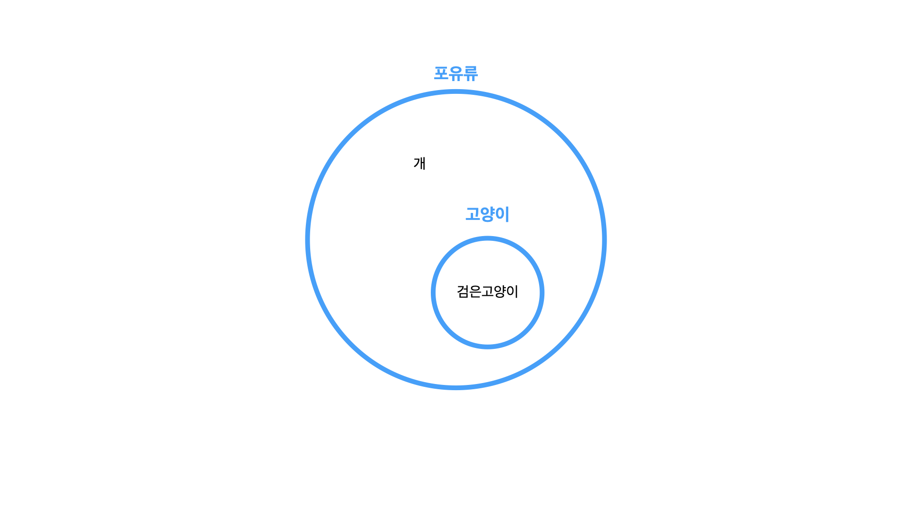
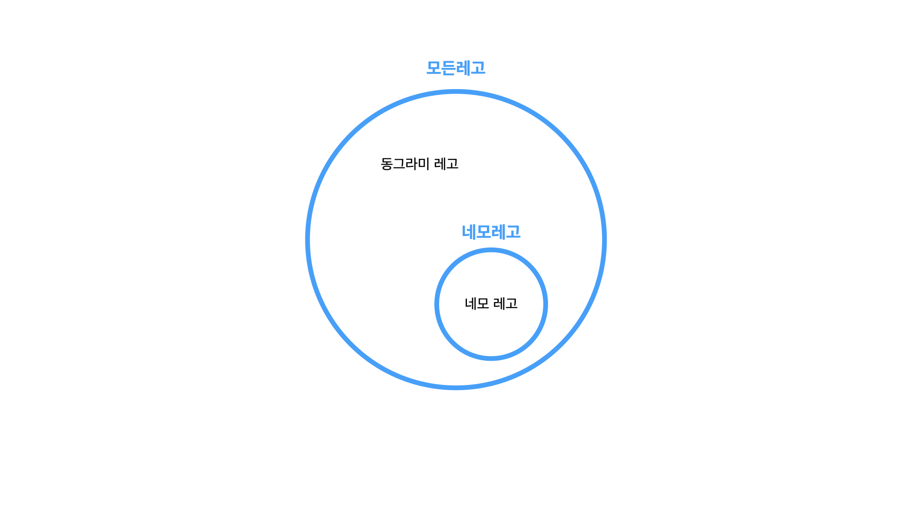
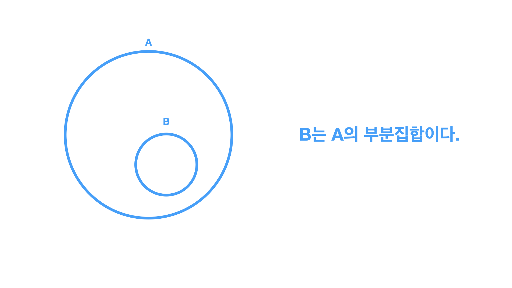
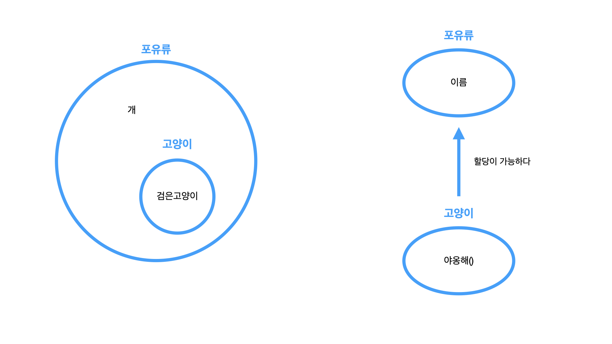
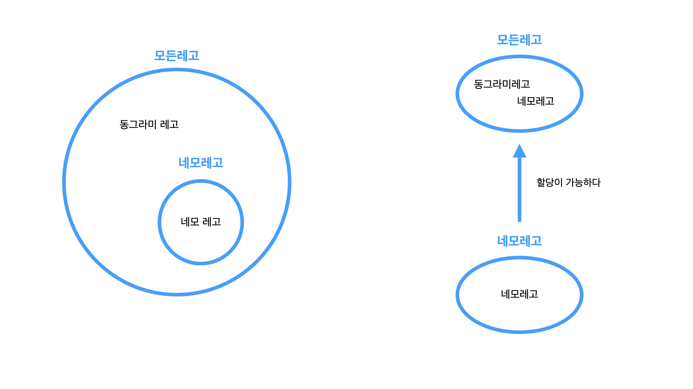

공변(Convariance)과 반공변(Contravariance) 라는 개념을 검색해보면 프로그래밍 언어 사이에 무관하게 적용되는 개념입니다.
타입스크립트를 사용하다보면 흔히 "Type 'XX' is not assignable to type 'YY'" 와 같은 에러를 마주하게 됩니다. 이는 "Type 'XXX' 는 Type 'YYY' 에 할당할 수 없습니다." 로 해석할 수 있습니다. 자주 보는 에러이지만 왜 이런 에러를 컴파일러가 제공하는지 한번 알아봅니다.

## 1단계: 비유해서 생각해보기

처음부터 개념에 대한 내용만 설명하면 잘 와닿지 않을 수 있으니, 비유해서 생각해보려합니다.

#### 동물



동물에는 고양이, 개 등 다양한 동물이 있습니다. 고양이와 동물 사이의 관계는 아래와 같습니다.

1. 고양이는 동물이다.
2. 모든 동물은 고양이가 아니다.

이를 통해 "고양이는 동물에 속하지만 모든 동물는 고양이가 아니다" 라는 사실을 끌어낼 수 있습니다.

#### 레고



네모레고만 담을 수 있는 네모레고상자가 있습니다. 그리고 네모레고 동그라미레고를 모두 담을 수 있는 모든레고상자가 있습니다.

1. 네모레고는 네모레고상자에 들어갈 수 있다.
2. 네모레고는 모든레고상자에 들어갈 수 있다.
3. 동그라미레고는 네모레고상자에 들어갈 수 없다.
4. 동그라미레고는 모든레고상자에 들어갈 수 있다.

이를 통해 모든레고상자는 동그라미레고를 갖을 수 있지만 네모레고상자는 동그라미레고를 포함할 수 없습니다.

## 2단계: 집합으로 생각해보기



집합은 특정한 조건에 맞는 원소들의 모임입니다.

집합에서 관계를 정의할 수 있는데 그 중 부분집합이라는 것이 있습니다.  
집합A에 속하는 모든 원소가 집합B에도 속한다면 집합A는 집합B의 부분집합이다 라고 정의할 수 있습니다.

> A의 원소와 B의 원소가 같을 때 A는 B의 부분집합이면서 B도 A의 부분집합이 됩니다. 이를 A와 B가 같다(A=B)라고 표기합니다.
> A의 원소와 B의 원소가 다를 때를 진부분집합 이라고 하는데요. 여기서는 편의상 진부분집합으로 예시를 듭니다.

1단계에서 들었던 예시를 이번에는 집합으로 다시 생각해보겠습니다.

#### 동물



- 고양이는 동물의 모든 특성을 가지고 있다.
- 모든동물은 고양이가 아니다.
- 고양이는 동물의 부분집합이다.

#### 레고



- 네모레고상자는 네모레고만 가질 수 있다.
- 네모레고는 네모레고상자와 모든레고상자에 들어갈 수 있다.
- 동그라미레고는 네모레고상자에 들어갈 수 없다.
- 동그라미레고는 모든레고상자에 들어갈 수 있다.
- 네모레고는 모든레고의 부분집합이다.

## 3단계: 타입스크립트로 생각해보기

이를 좀 더 구체화 시키기 위해 타입스크립트 코드로 표현하며 정리해보겠습니다.

## 동물

```ts
interface 동물 {
  이름: string
}

/* 동물의 특성을 상속받는다. */
interface 고양이 extends 동물 {
  야옹해(): void
}
```

코드에서는 흔히 extends 키워드를 통해 상속구조를 표현합니다. 고양이는 동물을 상속받아 동물의 특성을 모두 갖고있습니다.

고양이는 동물의 속성을 모두 상속받았으므로 이름과 야옹해를 라는 특징을 모두 가지고 있습니다.
고양이는 동물의 부분집합이기 때문에 다음과 같이 표현할 수 있습니다.

위의 코드를 풀어쓰면 다시 아래와 같이 작성할 수 있습니다.

```ts
interface 동물 {
  이름: string
}

interface 고양이 {
  이름: string
  야옹해(): void
}
```

표현하는 코드는 달라졌지만 집합으로 생각한다면 위의 도식과 일치합니다.  
여기서 알 수 있는점은 객체는 갖고있는 속성이 많아질수록 더 좁은 범위를 갖습니다.

## 레고

```ts
type 네모레고 = '네모레고'
type 모든레고 = '네모레고' | '동그라미레고'
```

네모레고와 동그라미레고는 리터럴(literal)타입입니다. 네모레고의 모든 원소를 모든레고가 가지고 있기 때문에 네모레고는 모든레고의 부분집합이다 라고 이야기할 수 있고 다음과 같은 도식으로 표현될 수 있습니다.

여기까지는 동물과 레고를 통해 비유를 하며 집합으로 생각해보며 이를 타입스크립트 코드로 간단하게 작성해보았습니다.
이제 위 비유를 바탕으로 본격적으로 공변과 반공변에 대해 알아보겠습니다.

---

## 고차타입 (Higher Order Type)

고차타입은 어떤 타입을 받아 더 복잡한 타입을 내는것을 고차타입이라 합니다. 예를들어 타입스크립트에는 제네릭(Generic)이라는 것이 있습니다.

### 제네릭 (Generic)

제네릭은 클래스나 함수를 사용할 때 타입을 선언하는 것인데, 만약 제네릭을 사용하지 않는다면 재사용성이 떨어집니다.

#### 제네릭을 사용하지 않을 때

```ts
/* 타입이 이미 정의된 클래스는 타입이 변경된다면 다시 새로운 타입을 정의해야한다. */
class 숫자배열 {}
class 문자배열 {}

const 숫자만담기는배열 = new 숫자배열()
const 문자만담기는배열 = new 문자배열()
```

#### 제네릭을 사용할 때

```ts
class 배열<타입> {}

/* 사용할 때 타입을 정의한다. */
const 숫자만담기는배열 = new 배열<숫자>()
const 문자만담기는배열 = new 배열<문자>()
const X만담기는배열 = new 배열<X>()
```

이제 제네릭을 이용하면 새로운 데이터 타입이 추가되어도 중복해서 배열을 작성하지 않아도 됩니다.

이처럼 고차타입의 예로 제네릭이 있습니다. 그렇다면 고차타입과 공변이 어떤 관계가 있을까요?

---

## 공변 (Covariance)

공변이란 B가 A의 부분집합일 때 고차함수 T에 대해 `T<B>` 도 `T<A>` 의 부분집합이 되면 T는 "공변한다" 라고 합니다.
즉 A와 B의 관계가 유지될 때 공변한다고 말합니다.

위에서 들었던 예시를 통해 공변을 조금 더 살펴봅니다.

### 동물

아래는 동물과 고양이를 배열(고차타입)에 넣고 그 관계가 유지되는지 살펴보는 코드입니다.

```ts
class 배열<타입> {}

interface 동물 {
  이름: string
}
interface 고양이 {
  이름: string
  야옹해(): void
}

let 동물배열 = new 배열<동물>()
let 고양이배열 = new 배열<고양이>()

// Case 1.
동물배열 = 고양이배열 // OK

// Case 2.
고양이배열 = 동물배열 // Error
```

**Case 1**
고양이는 동물의 특성을 모두가지고 있습니다. 즉 고양이는 동물이기 때문에 동물배열에 할당할 수 있습니다.

- 고양이는 동물이다.
  - 고양이가 동물의 부분집합이기 때문이다.
  - 고양이는 동물의 특성을 모두 가지고 있기 때문이다.
- 고차타입 배열에 적용
- 동물배열에는 고양이가 들어갈 수 있다.

**Case 2**

모든 동물은 고양이가 아닐 수 있기 떄문에 할당할 수 없습니다.

- 동물은 고양이가 아닐 수 있다.
  - 고양이 외에 개가 있을 수 있기 때문이다.
- 고차타입 배열에 적용
- 고양이배열에는 개가 들어갈 수 없다.

**결과**  
함수가 아닌 타입은 공변하는것을 증명합니다.

- 고양이는 동물의 서브타입이다.
  - 고양이는 동물이지만 모든동물은 고양이가 아니다.
- 고차타입 배열에 적용했다.
  - 동물배열에 고양이배열을 할당할 수 있다.
  - 고양이배열에 동물배열을 할당할 수 없다.
    - 개가 있을 수 있기에 거부
- 고차타입을 적용했더니 그 관계가 유지된다.

즉 고차타입 '배열'은 공변합니다.

### 레고

아래는 레고를 배열(고차타입)에 넣고 그 관계가 유지되는지 살펴보는 코드입니다.

```ts
class 배열<타입> {}

type 네모레고 = '네모레고'
type 모든레고 = '네모레고' | '동그라미레고'

let 네모레고배열 = new 배열<네모레고>()
let 모든레고배열 = new 배열<모든레고>()

// Case 1
모든레고배열 = 네모레고배열 // OK

// Case 2
네모레고배열 = 모든레고배열 // Error
```

**Case 1**  
네모레고는 모든레고의 부분집합입니다. 그렇기 때문에 네모레고가 들어있는 배열을 모든레고의 배열에 할당할 수 있습니다. 그 이유를 알아봅니다.

- 모든레고에 네모레고를 할당할 수 있다.
  - 네모레고가 모든레고의 부분집합이기 때문이다.
- 고차타입 배열에 적용
- 모든레고배열에 네모레고배열을 할당할 수 있다.
- 모든레고는 네모레고도 받을 수 있기 때문이다.

**Case 2**  
네모레고만 받는 배열에 모든레고를 넣었더니 에러가 발생합니다. 그 이유를 알아봅니다.

- 네모레고는 '동그라미레고'를 갖을 수 없다.
  - 네모레고가 모든레고의 부분집합이기 때문이다.
- 고차타입 배열에 적용
- 네모레고배열에 모든레고배열을 할당할 수 없다.
- 네모레고배열에 동그라미레고도 들어갈 수 있기 때문이다.

**결과**  
함수가 아닌 타입은 공변하는것을 증명합니다.

- 네모레고는 모든레고의 서브타입이다.
  - 네모레고는 모든레고에 할당이 가능하다.
- 고차타입 배열에 적용했다.
  - 네모레고배열은 모든레고배열에 할당할 수 있다.
  - 모든레고배열은 네모레고배열에 할당할 수 없다.
- 고차타입을 적용했을 때 그 관계가 유지된다.

즉 고차타입 '배열'은 공변합니다.

## 반공변 (Contravariance)

반공변은 공변의 반대로 B가 A의 부분집합일 때 고차함수 T에 대해 `T<A>` 가 `T<B>`의 부분집합이 되면 T는 "반공변한다" 라고 합니다.

타입스크립트에서 반공변하는 예는 함수의 매개변수로 사용될 때 반공변합니다. 잘 와닿지 않으니 이 부분도 예시를 들어봅니다.

### 동물

소개하기라는 함수는 함수의 매개변수를 고차타입으로 봅니다.

```ts
type 소개하기<T> = (대상: T) => void

interface 동물 {
  이름: string
}
interface 고양이 {
  이름: string
  야옹해(): void
}

let 동물소개하기: 소개하기<동물> = (대상: 동물) => {
  console.log(대상.이름)
}

let 고양이소개하기: 소개하기<고양이> = (대상: 고양이) => {
  console.log(대상.이름)
  console.log(대상.야옹해())
}

// Case 1
동물소개하기 = 고양이소개하기 // Error

// Case 2
고양이소개하기 = 동물소개하기 // Ok
```

> 이해 편의상 할당한다를 '시키다' 라고 대체합니다.

**Case1**  
동물소개하기에 고양이소개하기를 시켰습니다. 고양이소개하기는 '야옹해()' 라는 추가로직이 있습니다.

1. 동물소개하기에 고양이소개하기를 시킨다.
2. 모든 동물이 '야옹해()' 라는 것을 보장할 수 없다.

**Case2**
고양이소개하기에 동물소개하기를 시켰습니다. 동물소개하기는 '이름'만 말하면 됩니다.

1. 고양이소개하기에 동물소개하기를 시킨다.
2. 모든고양이는 '이름'이 있기 떄문에 동작이 보장된다.

**결과**  
함수의 매개변수가 반공변함을 증명합니다.

- 고양이는 동물의 서브타입이다.
  - 고양이는 동물의 특성을 모두 가지고 있다.
- 고차타입 '소개하기' 를 적용했다.
  - 소개하기<고양이> 는 소개하기<동물>에 할당이 불가능하다. (최소한의 동작을 보장할 수 없다.)
  - 소개하기<동물> 은 소개하기<고양이>에 할당이 가능하다.
- 고차타입을 적용했더니 고양이와 동물의 관계가 역전되었다.

즉, 고차타입 '소개하기'는 반공변합니다.

### 레고

염색파이프라인이라는 함수는 함수의 매개변수를 고차타입으로 봅니다.

```ts
type 염색파이프라인<T> = (재료: T) => void

type 네모레고 = '네모레고'
type 모든레고 = '네모레고' | '동그라미레고'

let 네모레고염색파이프라인: 염색파이프라인<네모레고> = (재료: 네모레고) => {
  // '네모레고'만 처리하는 파이프라인
}

let 모든레고염색파이프라인: 염색파이프라인<모든레고> = (재료: 모든레고) => {
  // '네모레고'와 '동그라미레고'를 처리하는 로직
}

// Case 1
네모레고염색파이프라인 = 모든레고염색파이프라인 // Ok

// Case 2
모든레고염색파이프라인 = 네모레고염색파이프라인 // Error
```

> 이해를 하기위해 편의상 '할당한다' 라는 것을 '교체한다' 로 표기했습니다.

**Case1**  
네모레고를 염색하는 파이프라인에 모든레고를 염색할 수 있는 파이프라인으로 교체했습니다.  
이는 교체가 가능한데, 그 이유를 알아봅니다.

1. 모든레고를 염색하는 파이프라인은 어떤레고든 염색이 가능하다.
2. 네모레고가 들어올 경우 대응이 가능하다. (최소한의 동작 보장 O)

**Case2**  
Case2의 경우 모든레고염색을 하는 파이프라인에 네모레고를 염색할 수 있는 파이프라인으로 교체했습니다.  
이는 교체가 불가능한데, 그 이유를 알아봅니다.

1. 네모레고를 염색하는 파이프라인은 네모레고만 염색이 가능하다.
2. 동그라미레고가 들어올 경우 대응이 불가능하다. 파이프라인은 고장난다. (최소한의 동작 보장 X)

**결과**  
함수의 매개변수가 반공변함을 증명합니다.

- '네모레고'는 '모든레고'의 서브타입이다.

  - 네모레고는 모든레고에 할당이 가능했다.

- 고차타입 '염색파이프라인' 을 적용했다.

  - '염색파이프라인<네모레고>' 는 '염색파이프라인<모든레고>' 에 할당할 수 없다.
  - '염색파이프라인<모든레고>' 는 '염색파이프라인<네모레고>' 에 할당이 가능하다.

- 고차타입을 적용했더니 '네모레고'와 '모든레고'의 관계가 역전되었다.

즉, 고차타입 '염색파이프라인'은 반공변합니다.

## 왜 중요할까?

정적타입언어를 사용할 때 수 많은 타입의 관계가 존재합니다. 그런데 만약 이 규칙을 어기게 된다면 어떻게 동작을 할까요?

만약 함수의 매개변수가 반공변하는것을 공변하게 만든다면 함수의 최소동작을 보장할 수 없게 되어 런타임에 에러가 발생할 수 있습니다.  
함수가 아닌타입에 공변하는것을 반공변하게 만든다면 고차타입에는 예상치 못한 타입이 등장해 에러가 발생할 수 있습니다.

### 타입스크립트에서 함수 표기법

타입스크립트에는 함수를 표기하는 방법이 두 가지 있습니다.

1. 화살표 함수로 표기하기 `() => void`
2. 속성 단축 구문(shorthand)으로 표기하기 `(): void`

#### 화살표 함수로 표기하기

```ts
interface Show<T> {
  onClick: (type: T) => void
}

declare let show동물: Show<동물>
declare let show고양이: Show<고양이>

show동물 = show고양이 // OK
show고양이 = show동물 // Error
```

#### 속성 단축 구문으로 표기하기

```ts
interface Show<T> {
  onClick(value: T): void
}

declare let show동물: Show<동물>
declare let show고양이: Show<고양이>

show동물 = show고양이 // OK
show고양이 = show동물 // OK
```

두 가지 사용법은 별차이가 없어 보이지만 속성 단축 구문으로 표기하는 경우 공변과 양변 모두 허용하는 양변(Bivariant)이 됩니다.
반대로 화살표 함수로 표기하면 반공변성이 적용되어 동작을 보장할 수 있게 됩니다.

이전에는 속성단축구문으로 작성했던 때가 있었는데, 특별한 이유가 없다면 보다 Type-Safe 한 화살표 함수로 표기하는것이 더 안전할 것 같습니다.

## 정리하며

자바스크립트에는 원래 타입시스템이 없었습니다. 그러나 타입스크립트가 나오면서 정적타입언어로 자바스크립트를 작성할 수 있게 되었는데 이로써 얻은 이점은 빌드타임에 타입의 에러를 잡아 런타임에러를 줄일 수 있게 되었습니다. 타입스크립트는 이런 안정성을 높이는것이 가장 큰 장점이라고 생각됩니다.

`Type 'XX' is not assignable to type 'YY'` 와 같이 사소하지만 자주 발생할 수 있는 에러가 왜 일어나는지 파악해봤고 타입스크립트에서 함수 표기를 어떻게 하면 더 안전하게 할 수 있는지도 알아보았습니다.

이후에는 위의 에러를 마주하게 될 때 보다 정확한 진단이 가능해질 것 같습니다.

## 참고문서

- [이펙티브 타입스크립트](http://www.kyobobook.co.kr/product/detailViewKor.laf?mallGb=KOR&ejkGb=KOR&barcode=9788966263134)
- [TypeScript: 공변과 반변, 그리고 객체 타입에서의 두 가지 함수 표기법](https://sorto.me/posts/2021-03-16+variance)
- [Covariance, contravariance and a little bit of TypeScript](https://medium.com/@michalskoczylas/covariance-contravariance-and-a-little-bit-of-typescript-2e61f41f6f68)
- [공변성이란 무엇인가](https://seob.dev/posts/%EA%B3%B5%EB%B3%80%EC%84%B1%EC%9D%B4%EB%9E%80-%EB%AC%B4%EC%97%87%EC%9D%B8%EA%B0%80/)
