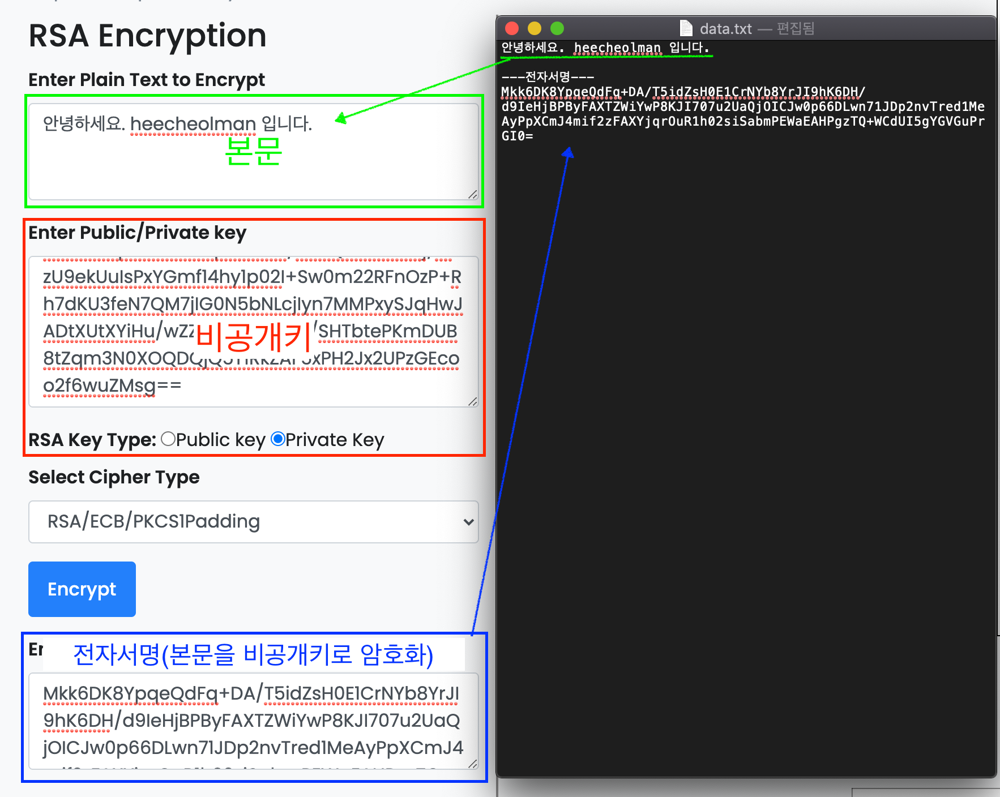

개발을 하다 보면 암호학과 관련한 다양한 용어들을 마주쳤던 것 같습니다. 단방향 암호화, 양방향 암호화, 공개키, 비밀키 등의 이런 용어들이 생소하게 다가왔는데 돌이켜 생각해보니 보안과 관련되어 중요한 개념이라 생각이 들어 이 기회에 정리해보려고 합니다. 제목은 '암호학' 이지만 수학과 관련된 복잡한 내용은 제외하려고 합니다.

## 암호의 중요성

우리는 일상생활에서 암호를 많이 사용하고 있는데 아이디와 비밀번호를 입력하면 서비스를 사용할 수 있는 인증을 받게 됩니다. 그렇기 때문에 타인이 나의 인증정보를 알게 된다고 하면 민감한 개인정보들이 탈취당할 수 있기 때문에 비밀번호를 주기적으로 변경하거나 남들이 유추할 수 있는 쉬운 비밀번호는 피해야 합니다.

### 과거의 암호

조금 더 과거로 돌아가 보면 전쟁에서 군사기밀을 유출하는 것은 전쟁의 승패를 좌지우지할 정도로 중요합니다. 제 2차 세계대전에서 독일은 에니그마(Enigma)라는 암호기를 이용해 교신내용을 암호화하여 연합군이 엿들어도 풀어낼 수 없게 했습니다. 하지만 '앨런 튜링' 이라는 사람이 애니그마의 암호를 해독할 수 있는 '봄브' 라는 해독기를 만들어 내어 독일의 전략을 알아내는 데 성공하여 크게 기여하게 됩니다.

> 앨런 튜링과 암호해독에 대해 다룬 영화: '이미테이션 게임'  
>  _출처: 네이버포토 - 스틸컷_

소프트웨어와 인터넷이 발전함에 따라 다양한 정보들이 오가며 암호학도 발전해 나갔습니다. 현대에서 사용되는 암호의 종류와 암호에 대한 기본 개념들을 살펴보겠습니다.

## 암호

위키백과에서 암호는 _"암호(cipher 또는 cypher)는 정보를 이해할 수 없도록 암호화하거나 다시 해독하기 위한 일련의 단계를 정의한 알고리즘이다."_ 라고 설명하고 있습니다. 즉, 암호는 정보를 다른 사람이 읽지 못하도록 하는 방법입니다. 그렇다면 다른 사람이 읽지 못하게만 한다면 암호라고 할 수 있을까요?

### 암호의 특성

암호의 기본 특성은 기밀성(Confidentiality), 무결성(Integrity), 인증(Authentication) 3가지가 있습니다.

- **기밀성(Confidentiality)**: 암호화된 내용이 무엇인지 알 수 없어야 한다는 특성
- **무결성(Integrity)**: 원본과 확실한 데이터라는 것이라는 특성
- **인증(Authentication)**: 권한이 있는 사람만 접근할 수 있는 특성

### 암복호화(encryption) 기본적인 과정

암호화가 되지 않은 자료를 **평문(plain text)**이라고 합니다. 평문을 **암호 알고리즘**을 통해 **암호문(cypher text)**으로 만드는 과정을 **암호화(encryption)**라고 합니다. 반대로, 암호문을 주어진 암호 알고리즘을 가지고 평문으로 돌이키는 과정을 **복호화(decryption)**라고 합니다.

평문을 암호문으로 만드는 암호화 과정과 암호문을 평문으로 만드는 복호화 과정에 필요한 암호화 방법을 암호 알고리즘이라고 하는데 이 알고리즘은 공개되어 있습니다. 대신, 알고리즘을 만들고 풀 때 필요한 비밀 정보를 섞어주는 데 이를 키(Key)라고 합니다.

그렇다면 암호화의 방법은 어떤 종류가 있을까요?

크게 양방향 암호화와 단방향 암호화로 나눌 수 있습니다. 양방향 암호화는 암호화와 복호화가 가능해 평문을 얻어 낼 수 있고, 단방향 암호화는 암호화만 가능하고 복호화는 불가능한 특징이 있습니다.

## 단방향 암호화

단방향 암호화는 암호화는 가능하지만, 복호화가 불가능한 특징을 가지고 있습니다. 복호화가 불가능하기 때문에 무결성에 초점을 두고 있습니다. 즉, 원본 데이터가 변경되었거나 훼손되지 않았는지 확인하는 데 초점을 둡니다. 예를 들어 비밀번호를 저장할 때 단방향으로 암호화하여 암호문을 저장해두고 사용자가 비밀번호를 다시 입력했을 때 저장된 암호문과 비교해서 일치하면 인증을 시켜줍니다.

**단방향 암호화를 다른 말로 해시(Hash)라고도 부릅니다.** 해시 알고리즘은 MD5, SHA 1, SHA 256, SHA 512 등이 있습니다. 단방향 암호화에 대해 테스트를 해볼 수 있는 [웹페이지](https://emn178.github.io/online-tools/sha512.html)가 있습니다.

테스트 삼아서 `heecheolman`이라는 평문을 SHA 512 알고리즘을 이용해 암호화했을 때 결과는 `1ba0e2bf28ce81160846ff64b4fed4bc26e722a1a599c56faf2411339f1951c898a1a38f71f4f3b1cbb87e9d8361ed6979f5e20131fb6307b396160684d1a50d` 라는 암호문이 됩니다.

> MD5 알고리즘은 보안상 이슈가 있어 권장하지 않습니다.(참고: [위키백과](https://ko.wikipedia.org/wiki/MD5))

> 해시(Hash)는 사전적 의미로 '다지다'라는 뜻을 가지고 있는데, 아마도 다진 음식을 다시 원상복구를 못 하기 때문에 붙여진 것이 아닐까 합니다.

## 양방향 암호화

양방향 암호화는 암호화와 복호화가 가능한 특징을 가지고 있습니다. 복호화가 가능하기 때문에 원래 데이터를 얻을 수 있는 특징이 있습니다. 복호화 방식에는 두 가지로 나뉘게 되는데 대칭키 암호화 방식과 비대칭 키 암호화 방식이 있습니다. 각각의 특징을 알아보겠습니다.

### 대칭키 암호화 방식

대칭키 암호화 방식은 암호화할 때 사용한 키(Key)를 복호화할 때도 동일하게 사용합니다. 그중 가장 유명한 대칭키 암호화 방식은 [AES](https://ko.wikipedia.org/wiki/%EA%B3%A0%EA%B8%89_%EC%95%94%ED%98%B8%ED%99%94_*%ED%91%9C%EC%A4%80)가 있습니다.

대칭키 암호화 방식을 테스트해보기 위해 [여기](https://encode-decode.com/aes256-encrypt-online/)서 AES-256 방식으로 진행해보겠습니다.

`heecheolman` 이라는 평문을 AES-256 알고리즘 방식으로 `secretKey`라는 Key를 주어 암호화하면 `sCKUnV1zhOTvVg2CvRsbVg==`라는 값이 나옵니다.

복호화 시에도 동일한 Key를 사용하기 때문에 암호문 `sCKUnV1zhOTvVg2CvRsbVg==` 를 `secretKey` Key로 복호화하면 다시 `heecheolman`라는 문자열이 나옵니다.

### 비대칭 키 암호화 방식

비대칭 키 암호화 방식은 대칭키 암호화 방식과 다르게 공개키(Public Key)와 비공개키(Private Key)라는 키 쌍(Key Pair)을 만들어 사용합니다. 먼저, 공개키를 이용해 암호화를 하고 비공개키를 이용해 복호화를 합니다. 즉, 대칭키방식과는 다르게 암호화와 복호화에 쓰이는 Key가 다르다고 하여 비대칭 키 암호화 방식입니다.

그렇다면 왜 이렇게 사용하는 걸까요?

#### 대칭키의 문제

그 이유는 대칭키 방식에서는 보안 문제가 발생할 수 있기 때문입니다. 대칭키 방식에는 암호화와 복호화에 쓰이는 Key가 동일합니다. A가 B라는 사람에게 암호문을 전달하고 싶다고 할 때 A는 대칭키를 이용해 암호화를 합니다. 그리고 B에게 암호문과 대칭 키를 전달합니다. 전달과정 중에 누군가 암호문과 대칭 키를 탈취했다고 가정해보면 그 누군가는 암호문을 대칭 키로 풀어서 정보를 얻어낼 수 있기 때문입니다.

#### 비대칭 키의 매커니즘

A가 B에게 메시지를 보내고 싶다고 한다는 설정을 해봅니다.

1. 먼저 B는 공개키(Public Key)와 비공개키(Private Key)라는 키 쌍을 만듭니다. 그리고 공개키를 A에게 알려줍니다. 공개키는 이름 그대로 누가 봐도 상관없기 때문에 인터넷이 올려도 상관없습니다.

2. 그리고 A는 전달받은 공개키를 이용해 보내고 싶은 평문을 암호화하여 암호문을 만듭니다. 그리고 B에게 암호문을 전달합니다. 공개키를 이용해 암호화한 암호문도 인터넷에 올려도 상관없습니다.

3. A는 전달받은 암호문을 자신이 가지고 있던 비공개키를 이용해 복호화하여 평문을 얻어냅니다.

여기서 인터넷으로 전달한 내용은 어떤 것들이 있을까요? 바로 공개키와 암호문입니다. 이렇게 공개적으로 공개키와 암호문을 올려두고 누군가 이 내용을 가져간다 해도 복호화에 사용되는 비공개키가 없기 때문에 정보를 습득할 수 없습니다. 이러한 특징 때문에 **비대칭 키 암호화 방식은 '공개키 방식' 이라고도 불립니다.**

비대칭 키 알고리즘 방식 중에 가장 유명한 방식이 [RSA방식](https://ko.wikipedia.org/wiki/RSA_%EC%95%94%ED%98%B8)입니다. 이를 테스트해 보기 위해 [여기](https://www.devglan.com/online-tools/rsa-encryption-decryption)서 확인해 보겠습니다.

1. 공개키와 비공개키를 생성해줍니다.
   

2. 공개키를 이용해 `Hello World!` 평문을 암호화해줍니다.
3. Encrypted Output으로 나온 것이 암호화된 암호문입니다. 암호문을 복호화하려는 Input에 넣어줍니다. 그리고 비공개키를 넣어주고 복호화합니다.
   

4. 평문인 `Hello World!`를 얻었습니다!

### 비대칭 키 - 전자서명

서명(Sign)이란 누군가가 문서에 기록했다는 증거로 자기 자신이 작성했음을 알리는 표시입니다. 이를 전자문서에 하는 방법을 전자서명이라고 하는데 어떻게 하는 거고 왜 필요한 걸까요?

누군가가 문서를 보낸다고 했을 때 누군가가 문서를 조작해서 수신자에게 보내준다면 수신자는 잘못된 정보를 얻게 될 수 있습니다. 그렇기 때문에 송신자는 문서에 전자서명을 하고 수신자는 문서에 송신자의 전자서명이 적혀있는지 확인하는 절차가 필요합니다. 이제 비대칭 키를 이용해 전자서명을 하는 방법을 알아봅니다.

#### 비대칭 키를 이용한 전자서명 원리

1. A가 B에게 문서를 보내고 싶다고 할 때 A는 공개키와 비공개키를 생성합니다. 공개키를 B에게 알려줍니다. (공개적인 곳에 올려도 무방합니다.)
2. A는 문서의 본문을 작성하고, 문서의 본문과 비공개키를 이용해 암호화한 것을 본문 하단에 넣어줍니다. 이것을 전자서명이라고 합니다.
3. 전자서명이 된 문서를 B에게 전달합니다.
   
4. B는 공개키를 이용해 전자서명을 복호화합니다.
5. 이때, B는 복호화한 값이 본문과 일치하는지 확인합니다.
6. 만약 일치한다면 A가 작성한 것이라고 확인할 수 있습니다.
   

## 정리

단방향 암호화(해시)와 양방향 암호화의 차이를 알고 비대칭 키를 이용해 전자서명을 하는 방법까지 알아봤습니다. 개발을 하다 보니 암호화에 대해 모르는 부분들이 있어 정리해보았습니다. 잘못된 부분이 있다면 댓글 달아주시면 감사하겠습니다.

## 참고자료

- [오픈튜토리얼 - 암호학](https://opentutorials.org/module/5250)
