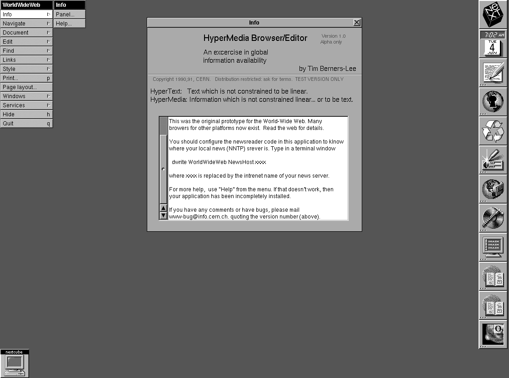
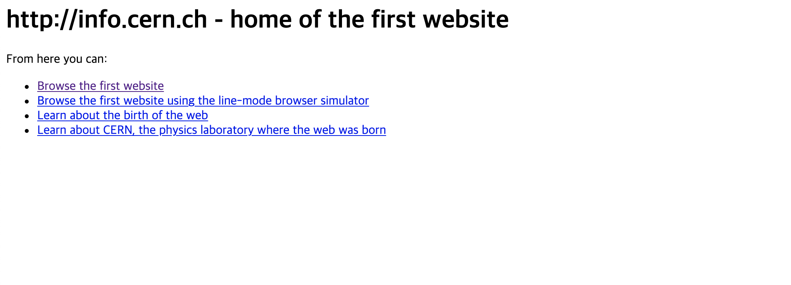
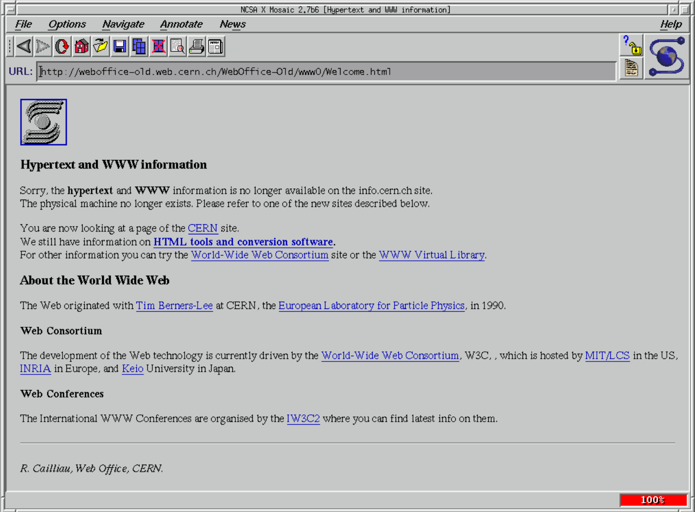
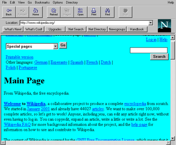
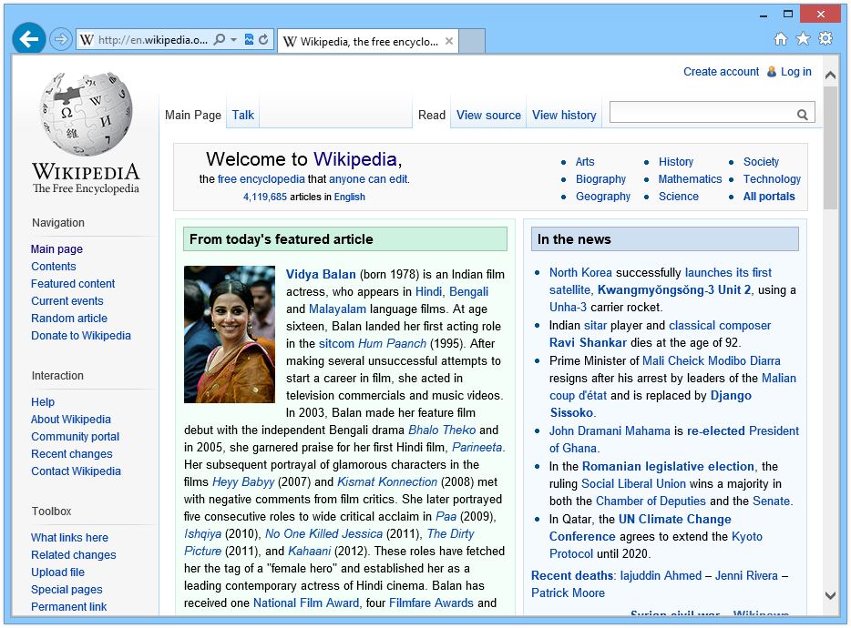
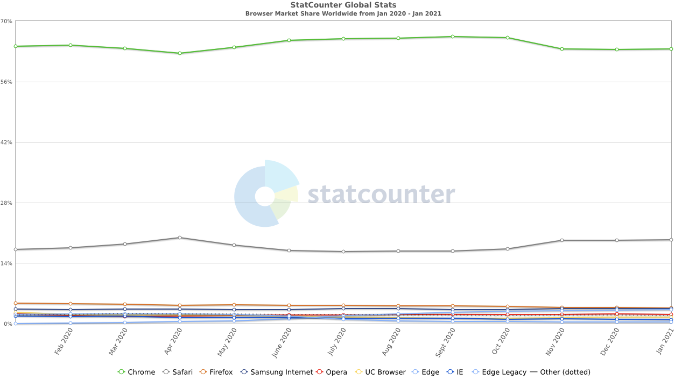
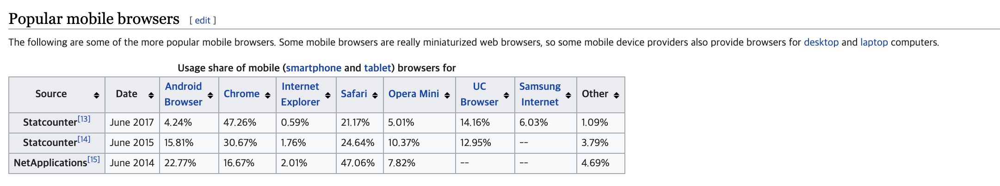
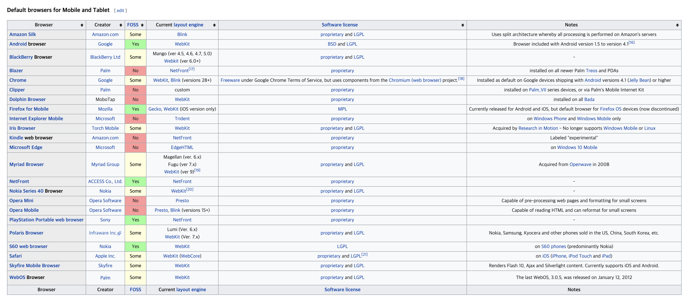

_브라우저는 왜이리 많은것인가......_

## 들어가며

우리가 사용하는 현재의 웹(Web)은 여러 형태가 있다고 생각합니다. 글을 보여주는 블로그 및 문서들을 보여주는 형태가 있을 것이고 페이스북, 인스타그램 등 사용자와 상호작용(Interaction)이 많아 마치 애플리케이션과 같은 사용자 경험을 주는 형태의 웹이 있을 것입니다.

현대사회에서 모바일은 생활 깊숙이 자리 잡아 있으며 사람들은 모바일에서 많은 것을 하고 싶어 합니다. 예를 들어 길거리만 봐도 교통예매, 은행 업무, 웹서핑 등 모바일에서의 많이 이뤄지고 있습니다. 또한 우리는 모바일 앱에서 이 화면이 네이티브(Android, iOS) 화면인지 웹으로 이루어진 화면인지 잘 분간하기 힘들 정도입니다.

이렇듯 웹은 우리 생활에 많이 사용되고 있는데 웹을 보여주는 브라우저도 다양합니다. 현재는 구글 크롬이 가장 많이 사용되는 브라우저인데 과거에는 어떤 브라우저들이 있었고 웹은 어떻게 탄생하게 되었는지에 대해 살펴보려고 합니다.

## 과거로 돌아가보자

### HyperText 기술을 사용한 HTML

웹페이지를 구성하는 HTML 언어는 Hyper Text Markup Language의 약자입니다. 그렇다면 HyperText 는 무엇을 뜻하는 것일까요?

우리가 어떤 것이 궁금하다고 웹에서 검색해서 나오는 웹페이지는 이와 관련된 다른 페이지들을 링크로 보여줍니다. 그리고 우리는 보고 싶은 문서를 들어가 살펴보고 글 안에서 어떤 관심 있는 링크가 있다면 해당 링크도 들어가서 문서들을 살펴봅니다.

이렇듯 문서와 문서 사이에 연결된 것이 많은데, 문서 간 이동하며 정보를 읽는 것을 우리는 웹서핑(Web Surfing) 혹은 웹 브라우징(Web Browsing)이라고 합니다. 즉, HyperText 는 한 문서에서 다른 문서로 바로 접근할 수 있는 텍스트를 말하는데 직역하면, Hyper(초월의) Text(문자) 라는 뜻입니다.

그리고 HTML은 HyperText 라는 기술을 이용해 웹페이지를 구성할 수 있는 언어입니다. 이를 이용해 웹페이지를 작성할 수 있게 된 것이죠.

그렇다면 우리가 보는 웹페이지들은 어떻게 검색이 되고 보이는 것일까요?

### WWW

~~우리가 따따따라고 부르는~~ WWW는 World Wide Web이라는 단어의 약자이며 웹(Web) 이라고도 불립니다. **WWW 은 인터넷을 통해 정보를 검색할 수 있도록 만들어진 시스템을 말합니다**.

WWW 은 유럽입자물리연구소라는 곳에서 여러 대학과 연구기관에서 일하는 물리학자들 사이에서 효율적이고 신속한 자료를 공유받기 위한 목적이었는데 1989년에 "팀 버너스리"에 의해 시작된 프로젝트였습니다.

이후 1990년 말에 HyperText 라는 프로젝트가 생겨났고 HyperText 를 이용한 기술 중 중요한 두 가지가 탄생하게 됩니다. 바로 HTML과 HTTP 라는 기술인데 HTML은 앞서 말했듯이 웹페이지를 구성하는 언어를 말하고 HTTP는 Hyper Text Transfer Protocol의 약자로 HyperText 를 전송하기 위한 통신규약(약속)을 의미합니다.

우리가 오늘날에 인터넷 안에서 WWW 시스템을 이용해 정보를 검색하고 웹 페이지(HTML 문서)를 받게 됩니다. 이때 눈에 보이지 않지만, HTML을 받기 위한 통신규약으로 HTTP 통신규약을 이용하게 되는 것이죠.

### 세계 최초의 웹 브라우저

세계 최초의 웹 브라우저는 "팀 버너스리"와 "로버트 카이오"가 공동 개발한 월드와이드웹(WorldWideWeb) 입니다.

위에서 설명했던 WWW와 동일하다고 생각했는데 차이를 살펴보면 World Wide Web 단어를 띄어 쓰면 추상적인 의미의 WWW 시스템을 의미하고 WordWideWeb 을 붙여서 쓰면 세계 최초의 브라우저를 의미합니다. 이는 WWW와 혼동하기 쉬워 나중에 Nexus 라고 이름을 변경했습니다.

세계 최초의 웹 브라우저는 "팀 버너스리"와 "로버트 카이오"가 공동 개발한 월드와이드웹(WorldWideWeb) 입니다.

위에서 설명했던 WWW와 동일하다고 생각했는데 차이를 살펴보면 World Wide Web 단어를 띄어 쓰면 추상적인 의미의 WWW 시스템을 의미하고 WordWideWeb 을 붙여서 쓰면 세계 최초의 브라우저를 의미합니다. 이는 WWW와 혼동하기 쉬워 나중에 Nexus 라고 이름을 변경했습니다.

> _The first web browser - or browser-editor rather - was called WorldWideWeb as, after all, when it was written in 1990 it was the only way to see the web. Much later it was renamed Nexus in order to save confusion between the program and the abstract information space (which is now spelled World Wide Web with spaces)._
>
> _출처: [https://www.w3.org/People/Berners-Lee/WorldWideWeb.html](https://www.w3.org/People/Berners-Lee/WorldWideWeb.html)_

최초의 브라우저인 "월드와이드웹"은 웹 탐색(Browser)의 역할과 편집(Edit)의 역할을 같이 했으며 NeXTSTEP이라는(애플의 공동설립자인 스티브 잡스가 설립한 넥스트 사에서 개발한 객체지향형 운영체제) 플랫폼 위에서 동작한다고 합니다.

1990년 크리스마스에 팀 버너스 리와 로버트 카이오는 자신들의 컴퓨터에서 월드와이드웹을 통해 [http://info.cern.ch/](http://info.cern.ch/) 라고 등록한 웹서버에 등록했는데 이것이 최초의 월드와이드웹이 탄생한 순간이라고 말합니다.

**_최초의 웹사이트_**

여기서 눈여겨봐야 할 것이 월드와이드웹은 탐색과 편집의 역할 둘 다 하고 있는데 이는 "팀 버너스리"와 "로버트 카이오"의 비전을 알 수 있었습니다. **즉, 웹브라우저는 위키처럼 다중 작성자의 환경(소셜 웹)을 뜻했는데 이후에 나오는 브라우저들은 편집의 역할을 빼고 탐색 기능만 제공하게 되어 본래 의도와 다르게 제공**되었다고 합니다.

**_월드와이드웹(Nexus) 데모 영상_**

<iframe width="100%" height="400px" src="https://www.youtube.com/embed/3c3Rt6QbHDw" frameborder="0" allow="accelerometer; autoplay; clipboard-write; encrypted-media; gyroscope; picture-in-picture"></iframe>

## 웹 브라우저의 춘추전국시대

최초의 월드와이드웹 브라우저는 텍스트 위주로 표현되었는데 이후에 나오는 모자이크(Mosaic) 브라우저는 이미지까지 표현할 수 있는 최초의 그래픽 웹 브라우저로 대중들의 인기를 끌었습니다. 이후에 많은 브라우저가 생기며 춘추전국시대를 맞이하게 됩니다.

### 모자이크(Mosaic)

1993년에 미국 일라노이대학교의 "마크 앤드리슨"과 "에릭 바나"가 공동개발했으며 이미지까지 표현이 가능한 최초의 그래픽 웹 브라우저입니다. 처음에 폭발적인 인기를 얻었지만 "마크 앤드리슨"이 동료들을 데리고 1994년에 넷스케이프를 설립하게 됩니다. 이후에 넷스케이프에서는 넷스케이프 내비게이터(Netscape Navigator) 브라우저를 개발하며 모자이크는 개발중단이 되어버립니다.

이후에 나오는 넷스케이프에 밀린 모자이크는 스파이글래스(Spyglass)라는 회사에 인수되어 "스파이글래스 모자이크"로 이름이 변경되었고, 이후에 **마이크로소프트가 스파이글래스에 저작권료를 지급하고 모자이크 소스 코드를 이용해 인터넷 익스플로러를 개발**하게 됩니다.

### 넷스케이프 내비게이터

1994년에 넷스케이프사가 개발한 브라우저로 당시 폭발적 인기를 얻어 점유율이 무려 90%까지 달했습니다. 하지만 1995년에 마이크로소프트가 인터넷 익스플로러(IE)를 개발한 뒤에 점유율이 급격하게 떨어졌습니다.

이는 마이크로소프트가 Windows 운영체제에 무료로 포함해 배포했기 때문에 운영체제 이외에 별도로 구매해야 한다는 점과 경쟁에서 살아남기 위해 비표준 기능을 표준화하려 무리한 시도를 하여 하위 호환성도 잃어버리게 되어 사람들에게 인기가 사라졌습니다.

이후 1997년 넷스케이프 커뮤니케이터(Netscape Communicator)를 내놓아 익스플로러와 대항하려 했지만 패배했고 이후에 나오는 넷스케이프 브라우저들도 줄줄이 패배했습니다. 2008년을 끝으로 넷스케이프의 개발이 중단되었으며 넷스케이프 출신 개발자들이 별도로 모질라 재단을 설립해 2002년에 파이어폭스(Firefox) 브라우저를 출시합니다.

### 인터넷 익스플로러

마이크로소프트가 1995년에 출시한 웹 브라우저로 Windows 운영체제에 기본으로 포함해 판매하여 사용자가 급격히 증가했습니다. 2003년에 점유율이 95%까지 도달해 많은 인기를 얻었습니다.

하지만 모질라 파이어폭스 등 다른 브라우저들이 출시되고 마이크로소프트 제품 이외의 플랫폼에서는 지원을 중단하며 인기는 점점 떨어지게 되었습니다.

## 브라우저 전쟁

브라우저 전쟁은 2003년 이후 인터넷 익스플로러와 이후에 나오는 구글 크롬, 모질라 파이어폭스, 사파리, 오페라 등 모던 브라우저들과의 경쟁을 말합니다.

브라우저 전쟁을 통해 인터넷 익스플로러는 점차 점유율이 떨어졌으며 2021년 기준으로는 구글 크롬이 점유율이 가장 높습니다.

_출처: [statcounter](https://gs.statcounter.com/)_

## 모바일 브라우저

현대사회에 모바일이 생활 깊숙이 자리 잡음에 따라 모바일에서 웹은 자주 사용하게 됩니다. 모바일에서 사용되는 주요 브라우저들은 크롬, 사파리, 삼성 인터넷, 오페라, 네이버 웨일, 엣지 등이 있습니다. 모바일은 데스크톱이나 노트북 환경보다 상대적으로 리소스(네트워크, 메모리 등)에 한계가 있기 때문에 자칫 잘못하면 사용자 경험이 떨어지는 웹서비스를 제공할 수 있습니다.

_가장 많이 사용되는 모바일 브라우저 목록_

_디바이스 기본 브라우저 목록_

[출처: 위키백과 - Mobile Browser](https://en.wikipedia.org/wiki/Mobile_browser)

## 마무리지으며

웹의 탄생과 다양한 브라우저들이 나오기까지 어떤 히스토리들이 있는지 간단히 알아봤습니다. 이러한 지식은 당장 급하게 필요한 것으로 생각하진 않지만, 저는 처음에 공부했을 때 자료들이 흩어져있어 헷갈렸던 경험이 있어서 한번 정리해보았습니다. 주로 위키백과를 통해 참고했으며 파생되는 하이퍼링크들로 문서를 읽어봤습니다.

**_"누가 이렇게 브라우저를 많이 만들었는가?"_**

## 참고문서

- [DIGITAL Archaeology - NEXUS 브라우저](https://digital-archaeology.org/the-nexus-browser/)
- [위키백과 - 월드 와이드 웹](https://ko.wikipedia.org/wiki/%EC%9B%94%EB%93%9C_%EC%99%80%EC%9D%B4%EB%93%9C_%EC%9B%B9)
- [위키백과 - 월드와이드웹](https://ko.wikipedia.org/wiki/%EC%9B%94%EB%93%9C%EC%99%80%EC%9D%B4%EB%93%9C%EC%9B%B9)
- [위키백과 - HTTP](https://ko.wikipedia.org/wiki/HTTP)
- [위키백과 - Mobile Browser](https://en.wikipedia.org/wiki/Mobile_browser)
- [W3org - The WorldWideWeb browser](https://www.w3.org/People/Berners-Lee/WorldWideWeb.html)
- [MDN - Javascript Array.prototype.includes()](https://developer.mozilla.org/ko/docs/Web/JavaScript/Reference/Global_Objects/Array/includes)
