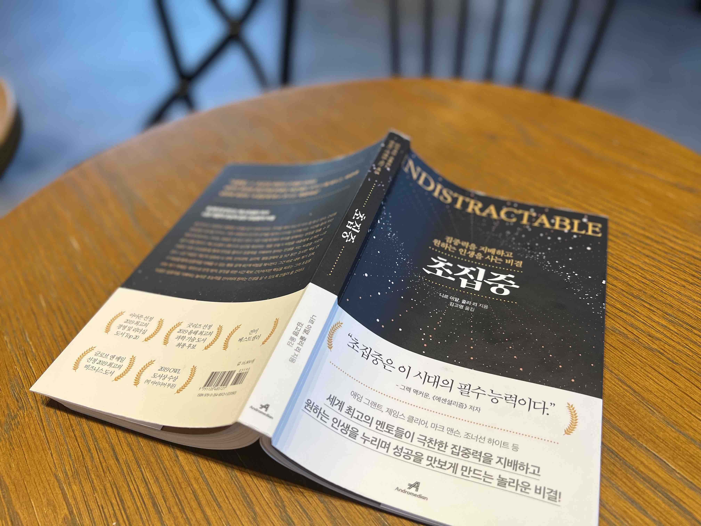
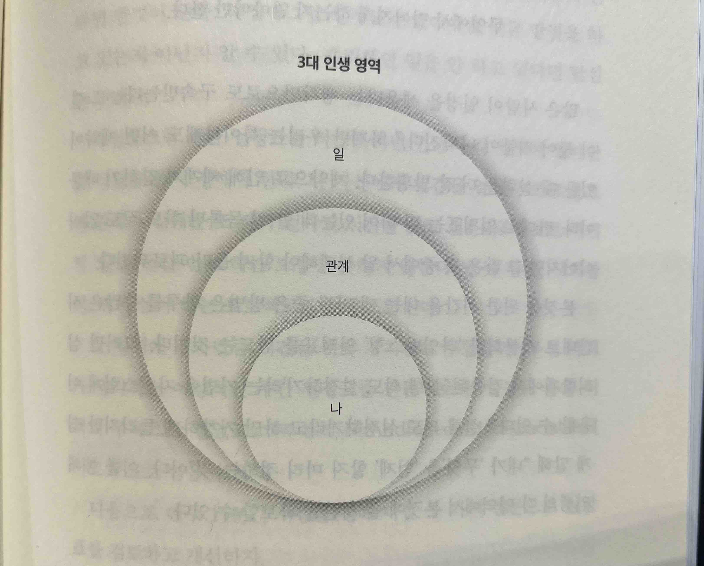

여러분은 인생을 살아가면서 집중을 하지 못하는 순간들이 있으신가요?

최근 아침에 일어나면 휴대폰에 쌓여있는 휴대폰 알람들, 집중하지 못하는 순간들이 많아지는 것 같아서 이것들을 잘 제어할 수 있는 방법에 대해 고민하고 있었습니다. 그러던 중 회사 슬랙 메신저에 '초집중' 이라는 책이 많이 올라오는 것을 보고 제목에 이끌려 읽었습니다.

여기서는 '초집중' 에서 이야기하는 '본짓과 딴짓' 을 알아보고 이를 잘 제어할 수 있는 방법들을 제시해줍니다. 이 중 제가 인상깊게 보았던 부분들을 개인적인 견해와 함께 정리해보았습니다.

---

## 본짓과 딴짓

우리가 집중해서 하고 싶은 일을 '본짓' 그리고 그 외의 행동들을 '딴짓' 이라고 합니다.

본짓은 영어로 'traction” 입니다. 라틴어의 '끌거나 당기다' 의 '트라헤레' 에서 유래한 말이라고 합니다. 이와 반대로 딴짓은 영어로 'dstraction” 입니다. 이는 라틴어의 의미로 '마음에서 멀어지게 한다” 라는 뜻이 있습니다. 즉, 본짓은 우리가 세운 목표에 가깝게 다가가는것이고 딴짓은 목표에서 멀어지게 됩니다.

그러면 우리는 왜 딴짓을 하게 될까요?

### 딴짓의 대표주자: 숏폼 콘텐츠

학창시절에 "딴짓하지마라", "집중해라" 라는 잔소리를 한번은 들어봤을 거에요. 저는 학창시절을 시골에서 보내서 도시보다 상대적으로 매우 조용한 편이었고 휴대폰도 고등학교 2학년때 처음 샀는데 어찌나 딴짓을 많이했던지 신기했습니다.

시간이 지나 직장생활을 하며 스마트폰도 최신으로 나오고 TV 방영 시간표를 보기보다는 우리가 언제든지 콘텐츠를 즐길 수 있는 유튜브, 넷플릭스, 인스타그램 등에서는 실시간으로 콘텐츠가 쏟아져 나옵니다. 이로인해 콘텐츠를 소비하기 위한 시간을 제어하는 주체가 방송사에서 개인들에게 넘어옵니다. 그러나 시간을 컨트롤하기란 쉽지 않습니다. 씻기전에 5분만 본다던지, 아침에 일어나서 10분만 뒹굴거리며 본다던지, 다양한 핑곗거리를 대며 1~3분은 가볍게 여깁니다.

티끌모아 태산이라고 위의 1~3분이 모아지면 대략 1시간정도는 모일 거 같아요. 유튜브 쇼츠나 인스타그램 릴스, 틱톡과 같이 짧은 영상들을 '숏폼 콘텐츠' 라고 하는데요. '숏폼 콘텐츠' 가 흥행하는 이유는 현대인들이 바쁘게 움직이기 때문에 시간은 분 단위, 초 단위로 쪼개지게되고 이 시간동안 집중해서 볼 수 있는 콘텐츠들이 더 구미가 당겨집니다. 이런 짧은 콘텐츠들에 적응이 되다보니 긴 콘텐츠들은 상대적으로 더 긴 집중이 필요하게 됩니다.

## 딴짓 극복하기

이 책의 초반에, 딴짓을 하고싶은 생각은 들 수 있지만 이는 극복할 수 있다고 합니다.

1. 딴짓에 선행하는 불편에 초점을 맞춰 내부계기 파악하기
2. 계기 기록하기
3. 감각 탐색하기
4. 넘이점 인식하기

### 1. 딴짓에 선행하는 불편에 초점을 맞춰 내부계기 파악하기

본짓을 하고있을 때 다른 일이 떠오른다면 과연 그 일이 필요해서 하는 일인지 되돌아볼 필요가 있습니다.

예를들어 개발을 하다가(본짓) '업무 메신저”를 보게 될 때가 있는데 과연 '업무 메신저 보기' 라는 행동이 본짓에 집중이 안되어서 보는것인지, 본짓을 하기위한 행동인것인지 구분을 해야합니다. 전자는 '딴짓'으로 판단할 수 있고 후자는 '본짓' 으로 판단할 수 있습니다.

### 2. 계기 기록하기

딴짓에 비록 굴복했다하더라도, 이를 기록해보며 행동을 파악해야합니다.

예를들어 '개발이 잘 안된다. 이참에 회사 메신저나 볼까?” 라는 생각이 떠오른다면 이 생각과 행동을 기록해보는것입니다.

### 3. 감각 탐색하기

본짓에서 딴짓으로 넘어가기 전 습관적으로 하는 행동들이 있을 것입니다.

저 같은 경우엔 집중력이 흐려질 때 먼산을 바라보곤 합니다. 그렇다면 '먼산을 바라본다' 라는 행동을 옮기기 전의 느낌을 충분히 관찰하는 것입니다.

### 4. 넘이점 인식하기

넘이점은 딴짓으로 넘어가는 그 시점을 말합니다. 로딩시간이 있어, 잠깐 다른 웹사이트를 본다던가, 신호를 기다리는 순간에 휴대폰을 본다던가 등의 넘이점입니다. 이 행동들이 잘못된 것은 아니지만, 딴짓으로 인해 다른 웹사이트에 30분 넘게 있는다던지, 휴대폰을 보다가 길을 잘못 든다던지 이러한 행동들이 잘못된 것입니다.

이 책에서는 '10분 원칙' 을 제안합니다. 딴짓의 충동이 느껴질 때 파도타기처럼 '충동타기'를 권유합니다. 충동이 강하게 일어날 때 바로 행동으로 옮기지 않고 충동을 느끼고 있으면 이를 버티기가 쉽다고 합니다. 10분이 넘어서도 충동이 일어난다면 해도 좋다고합니다.

## 본짓을 하기 위한 시간 마련하기

본짓을 하기 위해서는 시간을 마련하라고합니다. 시간을 관리하기 위해 보통 계획표라는 것을 세웁니다. 그러나 계획표를 세울 때 중요한 것은 '무엇' 을 해야하는지보다 '왜' 해야하는지에 초점을 맞춰야합니다. '왜' 해야하는지에 초점을 맞추기 위해서는 자신의 가치관을 세워야하는데 '어떤 사람이 되고싶은가?” 를 먼저 생각해봐야합니다.

예를들어 주변 사람들을 잘 챙겨주는 사람이 되고 싶은데 회사일이 많아 챙기지 못하게 된다면 가치관을 실현하지 못하게 됩니다. 이런 현상이 지속되면 이 사람은 주변 사람을 잘 챙겨주지 못한 미안한 마음에 회사업무에 집중하지 못하게 되고, 주변사람들을 챙겨주지 못해 미안한 마음이 계속생겨 악순환이 됩니다.

이를 해결하기 위해서는 다음과 같은 3대 영역을 정리해보고 영역에 맞는 시간계획을 짜야합니다.

### 3대 인생 영역: 나

소중한건 뭐라해도 '내 자신” 입니다. 각자 자신이 좋아하는 일들을 합니다. 그래서 '나' 를 위한 일정을 먼저 확보해야 다른 본짓에 집중할 수 있게 됩니다. 단적인 예로 '건강 챙기기', '수면 챙기기' 와 같은 기본적인 것들을 행해야합니다. 일하느라 대충 라면으로 떼우고, 수면도 불규칙적이라면 건강에 적신호가 옵니다.

여기서 '나' 의 일정을 계획할 때, 어쩌지 못하는 결과(output) 에 신경쓰기보다 투입(input) 을 신경쓰라는 말이 나옵니다. 왜냐면 결과는 우리가 어찌할 수 없는 영역이기 때문입니다. 즉, '어찌할 수 있는 일에 신경을쓰자” 입니다.

가령, 잠을 자고 새벽에 눈이 떠졌는데 다시 잠이 안오는 경우 스트레스를 받지 말고 일어나 다른것을 하면 됩니다. 눈이 떠지는 경우, 몸이 필요한만큼 휴식을 했기 때문에 눈이 떠진다고 합니다. 이렇게 생각하면 잠이 안드는 것에 스트레스를 받지 않게 되고 하고싶은 일을 하면 됩니다.

👉 **어찌할 수 있는 것에만 집중하자.**

### 3대 인생 영역: 관계

그 다음은 '관계” 입니다. 자기가 생각하는 중요한 '관계' 에 있는 사람들은 가족들 친척들 친구들 등 소중한 사람들이 있습니다. 소중한 사람들은 내가 남긴 찌꺼기 시간들에 만족을 하게 둬서는 안됩니다.

가족들과 저녁식사를 하기로 했는데 업무때문에 나중에 함께한다던지, 친구와 카페가서 이야기하기로 했는데 개인적인 일정 때문에 남는 시간에 만난다던지 등은 안 좋은 결과를 초래합니다.

👉 **소중한 사람들을 위해 그 사람들을 위한 일정을 정기적으로 잡자**

### 3대 인생 영역: 일

직장인이라면 일을 위한 시간을 당연히 씁니다. 하지만 회사에서 퇴근하고 와서도 메신저를 확인한다던지, 이메일을 확인한다던지 혹은 일이 늦어져 아예 집을 늦게 간다던지 등은 장기적으로 안좋은 결과를 초래합니다.

앞서 말했던 '나'와 소중한 '관계' 들의 균형이 무너져 회사 업무에도 지장이 갈 수 있습니다. 최근에는 코로나로 인해 재택근무가 많아지면서 일과 삶의 균형이 모호한 경우들이 있습니다. 이 경우도 조심해야 할 부분입니다.

_💡 집에서도 회사 업무에 신경을 씀 → 나와 관계에 집중을 못해 미안한 마음 → 회사 업무에 집중을 하지 못함 → 업무효율이 떨어짐 → ...(반복)_

👉 **직장에서 중요한 사람과 일정을 공유하고 조율하자. 이는 본짓을 하기 위해 필수이다.**

여기까지는 내부계기와 가치관에 맞는 일정 짜기를 알아보았습니다. 이후에는 '본짓'을 해치는 요소인 외부 계기를 막는법을 알아봅니다.

## 외부 계기 막기

외부에서 본짓을 방해하는 요소들은 '휴대폰 알람 소리', '앱의 빨간 숫자', '재밌는 피드들'과 같이 많습니다. 본짓을 하게 만드는 외부계기는 괜찮습니다. 하지만 대부분 외부계기는 딴짓을 하게 만드는 장치들입니다.

### 인적방해 역해킹

오피스에서 업무를 하거나 재택으로 업무를 보는 경우 사람으로부터 오는 시그널들이 있습니다. 이런 경우 집중력이 깨지기 마련입니다. 그래서 대부분 '헤드셋”이나 '이어폰'을 착용해 '집중하고 있다' 라는 것을 은연중에 표현합니다. 하지만 이는 명확한 전달 방법이 아닙니다.

집중을 하고 있을 때 '집중하고 있음” 이라는 팻말을 끼워두던가, 집에서는 방문을 닫고 '업무중' 이라는 것을 이용해 방해금지를 알릴 수 있습니다. 이렇게되면 상대는 내가 집중하고있다는것을 알게되고, 나 또한 본짓에 집중할 수 있게되어 그 다음 본짓을 하는데 도움이 될 수 있습니다.

**👉** **”내가 집중하고 있다” 라는것을 명확하게 상대방에게 표현하자.**

### 그룹채팅 역해킹

'슬랙'과 같이 그룹채팅을 하는 곳을 '사우나 처럼 이용해라' 라고 말합니다. 사우나도 오래있으면 안좋듯이, 그룹채팅도 하루종일 하면 안됩니다. '잡담채널', '업무채널” 처럼 목적을 분명하게 나누어 본짓에 집중할 수 있게 만듭니다.

중요한 사안이거나 이야기가 길어질 것 같다면 각자 생각을 정리해 의견을 남기도록 하는것이 좋습니다. 왜냐하면 그룹 채팅이기 때문에 실시간성이 있어 이모지, 단문메시지들이 오가서 집중을 흐릴 수 있기 때문입니다.

만약 급하지 않아 바로 확인을 해야하는것이 아니라면 메시지를 확인하는 시간을 따로 마련해두고, 다른 업무중이니 이후에 확인하겠다는 일정을 공유하면 일에 집중할 수 있고 오해도 사지 않습니다.

**👉그룹채팅을 하루종일 이용하지 말자. 사우나처럼 필요할 때 사용하자.**

### 회의 역해킹

회의는 어떤 안건들을 가지고 다수가 합의해 결정을 내리는 자리입니다. 회의시간을 잡을 때 효과적으로 잡으려면 어떻게 해야할까요?

먼저 회의를 만드는 사람에게 회의의 안건과, 자신이 생각한 사항들을 간략히 전달합니다. 이렇게 되면 회의에 참여하는 사람들은 미리 안건을 생각해올 수 있고, 해답을 바로 찾을수도 있습니다. 회의시간이 30분이라고 했을 때 한사람에게 30분이지만, 5명이 모인다면 150분입니다. 모두의 시간을 아껴 더 좋은 회의를 만들 수 있도록 해야합니다.

또 다른 문제는 회의시간에 급한일이 있다고 참여자가 다른 업무에 집중하거나, 지루해 스마트폰을 보고있는 상황입니다. 이 책에서 발제자 외에 휴대기기 스크린을 전부 사용하지 않고 회의를 했을 때 더 좋은 결과가 도출되었다고 합니다. 모든 상황을 100% 적용할 수 없겠지만, 사용하지 않으려 노력하는것이 중요할 거 같습니다.

**👉** **회의 안건을 회의 전에 공유해 미리 생각할 수 있도록하자.**  
**👉** **발제자 외 휴대기기 스크린을 제거해 회의라는 본짓에 집중할 수 있게 하자.**

### 스마트폰 역해킹

스마트폰에는 딴짓을 할 수 있는 가장 강력한 무기입니다. 수 많은 앱부터 메신저, 푸시알림 등이 있습니다. 우리가 본짓에 집중하기 위해 스마트폰을 역해킹해봅니다.

**1단계: 안쓰는 앱을 삭제**  
당연하게도 쓰지 않는 앱이 있을 때 불필요한 푸시알림이 오기도하고 의도치않게 켜는 경우도 있습니다.

**2단계: 사용방식 변경**  
시도때도 없이 좋아하는 앱을 켜서 확인하기보다는 'SNS 하는시간' 처럼 일정을 두어 사용하는것입니다.

**3단계: 정리하기**  
스마트폰을 잠금해제하면 앱이 잘 정돈되어있나요? 저 같은 경우는 카테고리별로 분류하긴 했지만 바탕화면에 중구난방으로 있습니다. 첫 화면에 정말 필요한 앱들만 남겨두는것으로 정리해볼 수 있습니다. 최근 아이폰에는 '홈 화면에서 제거' 라는 기능이 있는데 이를 활용해 제거해보고, 필요할 때 '검색'을 통해 앱에 접근하면 좋을 거 같습니다. 이와 같은 방식을 하게 되면 내가 원래 C 라는 앱을 켜기로 했는데 C앱을 찾다가 빨간점이 있는 앱으로 샌다던가 재밌어 보이는 앱을 켜는것을 방지할 수 있게됩니다.

**4단계: 교정하기**  
앱마다 알림설정을 할 수 있습니다. 이를 이용해 정말 필요한 앱들의 경우에 청각알림 시각알림을 두는것을 제안합니다. 만약 이것저것 챙기기 어려운 상황이라면, 아이폰의 '방해금지모드' 를 이용할 수 있는데 '방해금지모드' 를 여러가지 버전으로 나눌 수 있습니다.

제가 사용하는 방해금지모드는 '수면', '업무', '개인', '모두금지' 가 있습니다. 방해금지모드에는 다른사람이 전화하면 전화가 막히게 되는데, 특정 사람은 전화를 허용할 수 있는 옵션도 있습니다.

**👉** **스마트폰의 앱들을 정리하고 '방해금지모드' 를 사용해 본짓에 집중할 수 있도록 하자.**

---

## 마무리 지으며

본짓을 잘 하기 위해 딴짓을 감지하는 방법, 가치관을 기반으로 할일 목록을 적는법, 외부계기를 통제하는 법 등을 알아보았습니다. '초집중' 이라는 책에는 이 외에도 다양한 제안들을 하고 있습니다. 제가 인상깊게 보았던 부분들을 요약해 적어보니 실제로는 잘 실천하고 있는지 되돌아보게 되네요.

'바쁘다 바빠 현대사회, 알쏭달쏭 모바일세상' 이라는 말이 있을 정도로 정말 복잡한 현대사회에 제 자신이 컨트롤하지 못하면 이끌려 다닐 것 같아 책을 읽었는데, 꽤 도움이 많이 되는 것 같아서 독후감을 남겨봅니다.

> _출처: 놀라운토요일 -tvN_

## 참고

- [틱톡을 왜 보게 되는 걸까? 숏폼 콘텐츠 성공의 비밀!](https://www.youtube.com/watch?v=0P0Ut_p0jMI)
